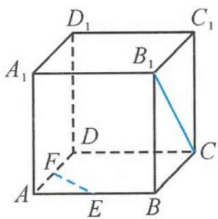
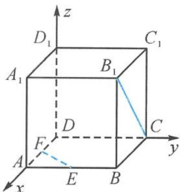

> [!faq]- 《浙大优辅《高中数学新体系 立体几何的秘密》》例题解析
>
> > [!success]- **【答案】** 详见解析
>
> > [!note]- **【分析】**
> > 本题未单列分析。
>
> > [!note]- **【解析】**
> > 解答 因为 $A_{1}D \parallel B_{1}C$ , 所以直线 $A_{1}D$ 与直线 $EF$ 所成的角等于直线
> > 
> > 图3.4-37
> > $B_{1}C$ 与直线 EF 所成的角.
> > 建立如图 3.4-38 所示的空间直角坐标系, 设正方体的棱长为 2, $F(t,0,0)$ , $0 \leqslant t \leqslant 2$ , 则
> > 所以
> > $$
> > \overrightarrow {D A _ {1}} = (2, 0, 2), \overrightarrow {F E} = (2 - t, 1, 0).
> > $$
> > 
> > $$
> > \cos \langle \overrightarrow {D A _ {1}}, \overrightarrow {F E} \rangle = \frac {2 - t}{\sqrt {2} \cdot \sqrt {(2 - t) ^ {2} + 1}} \leqslant \frac {\sqrt {1 0}}{5}.
> > $$
> > 图3.4-38
> > 如果说转化能力是立体几何学习的主旋律,那么借用能力则是立体几何学习的美妙协奏曲.只有两种能力巧妙地结合在一起,双剑合璧,才能完美地奏出立体几何这首交响曲.真可谓是“善借好风,直上青云”.
