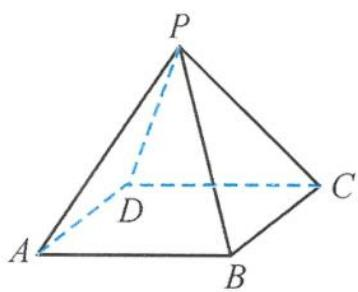

<!-- question-source:start -->
2. 如图, 在正四棱锥 $P-ABCD$ 中, 记异面直线 $PA$ 与 $CD$ 所成的角为 $\alpha$ , 直线 $PA$ 与平面 $ABCD$ 所成的角为 $\beta$ , 二面角 $P-BC-A$ 的平面角为 $\gamma$ , 则 ( ). A. $\beta < \alpha < \gamma$ B. $\gamma < \alpha < \beta$ C. $\beta < \gamma < \alpha$ D. $\alpha < \beta < \gamma$

第2题图
<!-- question-source:end -->

![[Q00036008A1]]
