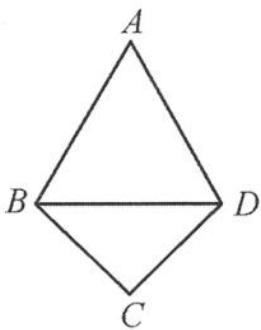

<!-- question-source:start -->
4. 在正方体 $ABCD-A_{1}B_{1}C_{1}D_{1}$ 中, 已知 P 在棱 AB 上运动(包括端点). 在运动过程中, 平面 $PDB_{1}$ 与平面 $ADD_{1}A_{1}$ 所成的最小角为 $\alpha$ , 则 $\cos \alpha = (\quad)$ .
A. $\frac{\sqrt{2}}{2}$ B. $\frac{\sqrt{2}}{3}$ C. $\frac{\sqrt{3}}{3}$ D. $\frac{\sqrt{6}}{3}$

<!-- question-source:end -->

![[Q00036010A1]]
