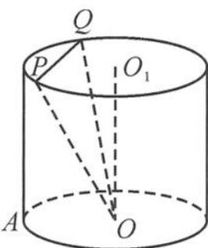

<!-- question-source:start -->
8. 如图, 已知圆柱 $O_{1} O$ , 点 $A$ 在圆 $O$ 上, $A O = 1, O_{1} O = \sqrt{2}, P, Q$ 在圆 $O_{1}$ 上, 且 $P Q = \frac{2 \sqrt{3}}{3}$ , 则直线 $A O_{1}$ 与平面 $O P Q$ 所成角的正弦值的取值范围是 ( ).

A. $\left[\frac{3 - \sqrt{6}}{6}, \frac{3 + \sqrt{6}}{6}\right]$ B. $\left[0, \frac{3 + \sqrt{6}}{6}\right]$ C. $\left[\frac{3 - \sqrt{6}}{6}, 1\right]$ D. $[0, 1]$

<!-- question-source:end -->

![[Q00036014A1]]
