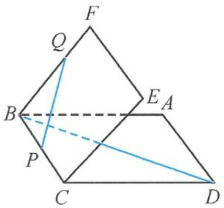
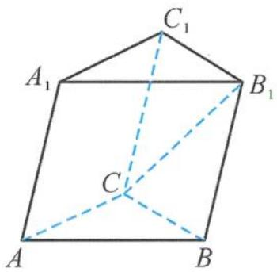

<!-- question-source:start -->
11. 如图, 已知正方形 $ABCD$ 与正方形 $BCEF$ 所成二面角的平面角是 $45^{\circ}$ , $PQ$ 是正方形 $BCEF$ 所在平面内的一条动直线, 则直线 $BD$ 与 $PQ$ 所成角的取值范围是 \_\_\_\_.

第11题图

第12题图
<!-- question-source:end -->

![[Q00036017A1]]
