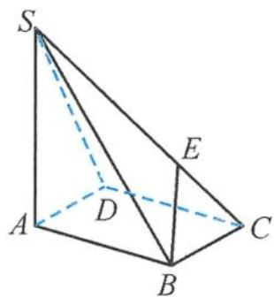
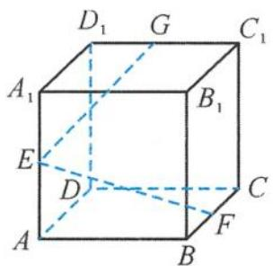
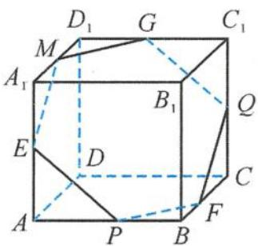

> [!faq]- 《浙大优辅《高中数学新体系 立体几何的秘密》》例题解析
>
> > [!success]- **【答案】** B
>
> > [!note]- **【分析】**
> > 本题未单列分析。
>
> > [!note]- **【解析】**
> > 解答 因为
> > $$
> > \overrightarrow {B O} = x \overrightarrow {B G} + y \overrightarrow {B F} + z \overrightarrow {B E} = x \overrightarrow {B G} + y \overrightarrow {B F} + \frac {3 z}{4} \overrightarrow {B B _ {1}},
> > $$
> > 点 O 在平面 $B_{1}GF$ 内, 所以
> > $$
> > x + y + \frac {3 z}{4} = 1.
> > $$
> > 同理可得
> > $$
> > \frac {x}{2} + \frac {y}{2} + z = 1, x = y,
> > $$
> > 解得
> > $$
> > x = y = \frac {1}{5}, z = \frac {4}{5}.
> > $$
> > 故选 B.
> > 点评 利用空间向量的共面定理可得 $\overrightarrow{BO}$ 在不同基底下的表示方法,从而可求.
> > 引申1 如图4.1-1, 已知四棱锥S-ABCD的底面是平行四边形, 且 $\overrightarrow{SE} = 2\overrightarrow{EC}$ , 若满足 $\overrightarrow{BE} = x\overrightarrow{AB} + y\overrightarrow{AD} + z\overrightarrow{AS}$ , 则 $x + y + z =$ \_\_\_\_. 解答 已知 $\overrightarrow{SE} = 2\overrightarrow{EC}$ , 则
> > $$
> > \overrightarrow {C E} = \frac {1}{3} \overrightarrow {C S}.
> > $$
> > 
> > 图4.1-1
> > 四棱锥 S-ABCD 的底面是平行四边形, 即 ABCD 为平行四边形, 则
> > $$
> > \overrightarrow {A D} + \overrightarrow {A B} = \overrightarrow {A C}.
> > $$
> > 从而
> > $$
> > \begin{array}{r l} & {\overrightarrow {B E} = \overrightarrow {B C} + \overrightarrow {C E} = \overrightarrow {A D} + \frac {1}{3} \overrightarrow {C S} = \overrightarrow {A D} + \frac {1}{3} (\overrightarrow {A S} - \overrightarrow {A C})} \\ & {\quad = \overrightarrow {A D} + \frac {1}{3} (\overrightarrow {A S} - \overrightarrow {A B} - \overrightarrow {A D})} \\ & {\quad = \frac {1}{3} \overrightarrow {A S} + \frac {2}{3} \overrightarrow {A D} - \frac {1}{3} \overrightarrow {A B}.} \end{array}
> > $$
> > 又 $\overrightarrow{BE} = x\overrightarrow{AB} +y\overrightarrow{AD} +z\overrightarrow{AS}$ ，所以
> > $$
> > x = - \frac {1}{3}, y = \frac {2}{3}, z = \frac {1}{3},
> > $$
> > 从而
> > $$
> > x + y + z = \frac {2}{3}.
> > $$
> > 答案为 $\frac{2}{3}$ .
> > 引申 2 如图 4.1-2, 已知正方体 $ABCD-A_{1}B_{1}C_{1}D_{1}$ 的棱长为 $1, E, F, G$ 分别是棱 $AA_{1}$ , $BC, C_{1}D_{1}$ 的中点, 设 $M$ 是该正方体表面上的一点, 若 $\overrightarrow{EM} = x\overrightarrow{EF} + y\overrightarrow{EG}(x, y \in \mathbb{R})$ , 则点 $M$ 的轨迹长度是 \_\_\_\_.
> > 
> > 图4.1-2
> > 
> > 图4.1-3
> > 解答 因为 $\overrightarrow{EM} = x\overrightarrow{EF} + y\overrightarrow{EG}(x, y \in \mathbb{R})$ ，所以 $\overrightarrow{EM}, \overrightarrow{EF}, \overrightarrow{EG}$ 共面，即点 $M$ 在平面 $EFG$ 上。从而得点 $M$ 在平面 $EFG$ 与正方体的截面上，故点 $M$ 的轨迹是图4.1-3所示的正六边形 $EPFQGM$ ，点 $M$ 的轨迹长度是 $6 \times \frac{\sqrt{2}}{2} = 3\sqrt{2}$ 。
