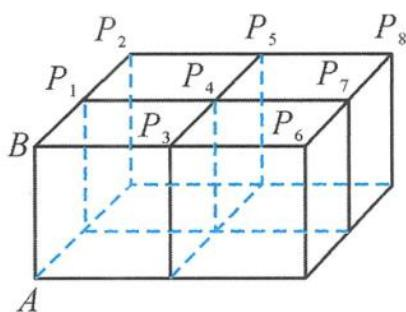

> [!faq]- 《浙大优辅《高中数学新体系 立体几何的秘密》》例题解析
>
> > [!success]- **【答案】** A
>
> > [!note]- **【分析】**
> > 本题未单列分析。
>
> > [!note]- **【解析】**
> > 
> > 图4.2-1
> > 解答 由题意易知直线 AB 与上底面垂直, 因此
> > $$
> > A B \perp B P _ {i} (i = 1, 2, \dots),
> > $$
> > 从而
> > $$
> > \overrightarrow {A B} \cdot \overrightarrow {A P _ {i}} = | \overrightarrow {A B} | | \overrightarrow {A P _ {i}} | \cos \angle B A P _ {i} = | \overrightarrow {A B} | | \overrightarrow {A B} | = 1.
> > $$
> > 答案为 A.
> > 点评 也可以把问题转化为求向量 $\overrightarrow{AP_{i}}(i=1,2,\cdots)$ 在向量AB上投影的数量积.
