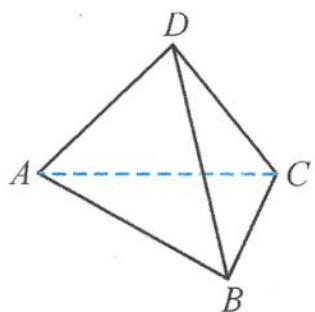
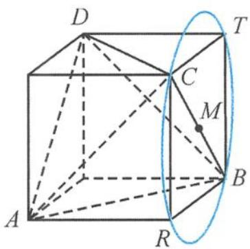

> [!faq]- 《浙大优辅《高中数学新体系 立体几何的秘密》》例题解析
>
> > [!success]- **【答案】** 详见解析
>
> > [!note]- **【分析】**
> > 本题未单列分析。
>
> > [!note]- **【解析】**
> > 解法一 （利用运算）设 M 为 BC 的中点，则
> > $$
> > | \overrightarrow {P M} | = 1.
> > $$
> > 
> > 图4.2-3
> > 故
> > $$
> > \begin{array}{r l} & {\overrightarrow {A P} \cdot \overrightarrow {A D} = (\overrightarrow {A M} + \overrightarrow {M P}) \cdot \overrightarrow {A D}} \\ & {\qquad = \overrightarrow {A M} \cdot \overrightarrow {A D} + \overrightarrow {M P} \cdot \overrightarrow {A D}} \\ & {\qquad = \frac {| \overrightarrow {A M} | ^ {2} + | \overrightarrow {A D} | ^ {2} - | \overrightarrow {M D} | ^ {2}}{2} + | \overrightarrow {M P} | \cdot | \overrightarrow {A D} | \cos \theta} \\ & {\qquad = 2 + 2 \cos \theta \in [ 0, 4 ]. (\text {其中} \theta = \langle \overrightarrow {M P}, \overrightarrow {A D} \rangle)} \end{array}
> > $$
> > 解法二 (利用投影) 把正四面体 $A - BCD$ 补成棱长为 $\sqrt{2}$ 的正方体. 设 $M$ 为 $BC$ 的中点, 则 $|\overrightarrow{PM}| = 1$ .
> > 所以点 $P$ 在以 $M$ 为球心、1 为半径的球面（图 4.2-4 为过球心的一个截面）上运动。因此：
> > $$
> > (\overrightarrow {A P} \cdot \overrightarrow {A D}) _ {\min} = 0;
> > $$
> > 当 $P$ 在点 $T$ 处时，
> > $$
> > (\overrightarrow {A P} \cdot \overrightarrow {A D}) _ {\max} = 2 \times 2 = 4.
> > $$
> > 
> > 所以 $\overrightarrow{AP}\cdot\overrightarrow{AD}$ 的取值范围是[0,4].
> > 图4.2-4
