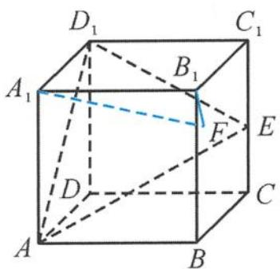
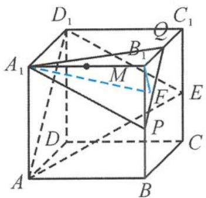

> [!faq]- 《浙大优辅《高中数学新体系 立体几何的秘密》》例题解析
>
> > [!success]- **【答案】** 详见解析
>
> > [!note]- **【分析】**
> > 本题未单列分析。
>
> > [!note]- **【解析】**
> > 
> > 图4.2-5
> > 
> > 图4.2-6
> > 解答 如图 4.2-6, 设 $BB_{1}, B_{1}C_{1}$ 的中点分别为 P, Q, 连接 $A_{1}P, PQ, A_{1}Q$ , 得平面 $A_{1}PQ$ // 平面 $D_{1}AE$ . 因为 F 是侧面 $BCC_{1}B_{1}$ 内的动点 (包括边界), 所以点 F 在线段 PQ 上运动. 设 $A_{1}B_{1}$ 的中点为 M, 则
> > 设 $A_{1}B_{1}$ 的中点为 $M$ ，则
> > $$
> > \mid \overrightarrow {F M} \mid_ {\min} = \frac {\sqrt {6}}{2}.
> > $$
> > 由向量的极化恒等式得
> > $$
> > \overrightarrow {F A _ {1}} \cdot \overrightarrow {F B _ {1}} = \left(\frac {\overrightarrow {F A _ {1}} + \overrightarrow {F B _ {1}}}{2}\right) ^ {2} - \left(\frac {\overrightarrow {F A _ {1}} - \overrightarrow {F B _ {1}}}{2}\right) ^ {2} = | \overrightarrow {F M} | ^ {2} - 1 \geqslant \left(\frac {\sqrt {6}}{2}\right) ^ {2} - 1 = \frac {1}{2}.
> > $$
> > 故答案为 $\frac{1}{2}$ .
> > 引申 在长方体 $ABCD-A_{1}B_{1}C_{1}D_{1}$ 中, 已知 AB = 2, AD = 4, $AA_{1} = 4$ , O 为对角线 $AC_{1}$ 的中点, 过点 O 的直线与长方体表面交于两点 M, N, 点 P 为长方体表面上的动点, 则 $\overrightarrow{PM} \cdot \overrightarrow{PN}$ 的取值范围是 \_\_\_\_.
> > 解答 由极化恒等式得
> > $$
> > \overrightarrow {P M} \cdot \overrightarrow {P N} = \left(\frac {\overrightarrow {P M} + \overrightarrow {P N}}{2}\right) ^ {2} - \left(\frac {\overrightarrow {P M} - \overrightarrow {P N}}{2}\right) ^ {2} = | \overrightarrow {P O} | ^ {2} - \frac {| \overrightarrow {M N} | ^ {2}}{4},
> > $$
> > 所以
> > $$
> > \overrightarrow {P M} \cdot \overrightarrow {P N} \in [ - 8, 8 ].
> > $$
> > 点评 不管在平面还是在空间,都活跃着向量的极化恒等式 $a \cdot b = \left(\frac{a + b}{2}\right)^2 - \left(\frac{a - b}{2}\right)^2$ .
> > 向量的极化恒等式有着非常广泛的应用,所以在学习中我们不能将其边缘化,有必要对其进行
> > 梳理总结.
