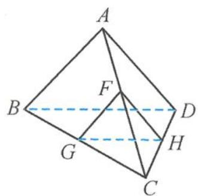

> [!faq]- 《浙大优辅《高中数学新体系 立体几何的秘密》》例题解析
>
> > [!success]- **【答案】** 详见解析
>
> > [!note]- **【分析】**
> > 本题未单列分析。
>
> > [!note]- **【解析】**
> > 解答 如图 4.2-7, 设 AC, CD 的中点分别为 F, H, 得平面 GEH // 平面 ABD, 所以点 E 在 HF 上,
> > $$
> > \overrightarrow {A E} = \lambda \overrightarrow {A F} + (1 - \lambda) \overrightarrow {A H}.
> > $$
> > 等号两边点乘 $\overrightarrow{BD}$ , 由于正四面体对棱垂直, 所以 $\overrightarrow{BD} \cdot \overrightarrow{AF} = 0$ , 得
> > $$
> > \overrightarrow {A E} \cdot \overrightarrow {B D} = (1 - \lambda) \overrightarrow {A H} \cdot \overrightarrow {B D} = 2 (1 - \lambda) \overrightarrow {H A} \cdot \overrightarrow {H G} = 1.
> > $$
> > 
> > $$
> > \text {而} \overrightarrow {H A} \cdot \overrightarrow {H G} = \frac {| \overrightarrow {H A} | ^ {2} + | \overrightarrow {H G} | ^ {2} - | \overrightarrow {A G} | ^ {2}}{2} = \frac {(2 \sqrt {3}) ^ {2} + 2 ^ {2} - (2 \sqrt {3}) ^ {2}}{2} =
> > $$
> > 图4.2-7
> > 2, 所以 $\lambda = \frac{3}{4}$ , 从而
> > $$
> > \overrightarrow {A E} = \frac {3}{4} \overrightarrow {A F} + \frac {1}{4} \overrightarrow {A H}.
> > $$
> > 对上式平方得
> > $$
> > | \overrightarrow {A E} | = \frac {\sqrt {2 1}}{2}.
> > $$
