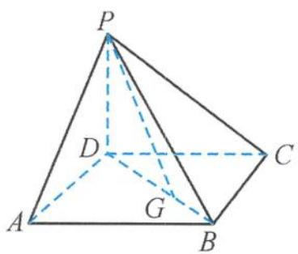
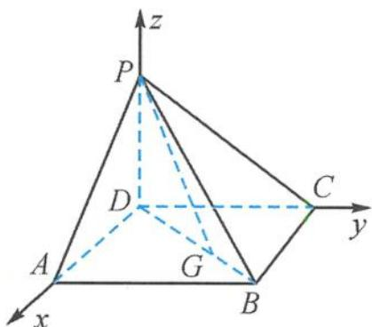

> [!faq]- 《浙大优辅《高中数学新体系 立体几何的秘密》》例题解析
>
> > [!success]- **【答案】** 详见解析
>
> > [!note]- **【分析】**
> > 本题未单列分析。
>
> > [!note]- **【解析】**
> > 
> > 图4.2-8
> > 
> > 图4.2-9
> > 解答 因为 $PD \perp$ 底面 $ABCD$ , 底面 $ABCD$ 是正方形, 所以 $PD, DA, DC$ 两两垂直. 以 $D$ 为坐标原点, 建立如图 4.2-9 所示的空间直角坐标系, 则有
> > $$
> > D (0, 0, 0), P (0, 0, 1), A (3, 0, 0), B (3, 3, 0), C (0, 3, 0).
> > $$
> > 从而 $\triangle ABC$ 的重心为 $G(2,2,0)$ ,
> > $$
> > \overrightarrow {P G} = (2, 2, - 1), \overrightarrow {P A} = (3, 0, - 1), \overrightarrow {P B} = (3, 3, - 1).
> > $$
> > 设平面 PAB 的一个法向量为 $\boldsymbol{m} = (x, y, z)$ ，则
> > $$
> > \left\{ \begin{array}{l} m \cdot \overrightarrow {P A} = 3 x - z = 0, \\ m \cdot \overrightarrow {P B} = 3 x + 3 y - z = 0. \end{array} \right.
> > $$
> > 令 $x = 1$ ，则
> > $$
> > \pmb {m} = (1, 0, 3).
> > $$
> > 从而
> > $$
> > \sin \theta = | \cos \langle \boldsymbol {m} \cdot \overrightarrow {P G} \rangle | = \frac {| \boldsymbol {m} \cdot \overrightarrow {P G} |}{| \boldsymbol {m} | | \overrightarrow {P G} |} = \frac {1}{\sqrt {1 0} \times 3} = \frac {\sqrt {1 0}}{3 0}.
> > $$
> > 故答案为 $\frac{\sqrt{10}}{30}$ .
