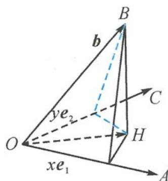

> [!faq]- 《浙大优辅《高中数学新体系 立体几何的秘密》》例题解析
>
> > [!success]- **【答案】** D
>
> > [!note]- **【分析】**
> > 本题未单列分析。
>
> > [!note]- **【解析】**
> > 解答 如图 4.3-1, 由题意知, 向量 $\boldsymbol{b} - (x_{0}\boldsymbol{e}_{1} + y_{0}\boldsymbol{e}_{2})$ 为 $e_{1}, e_{2}$ 所在平面的法向量, 则
> > $$
> > \left\{ \begin{array}{l} {\left[ \pmb {b} - (x _ {0} \pmb {e} _ {1} + y _ {0} \pmb {e} _ {2}) \right] \bullet \pmb {e} _ {1} = 0,} \\ {\left[ \pmb {b} - (x _ {0} \pmb {e} _ {1} + y _ {0} \pmb {e} _ {2}) \right] \bullet \pmb {e} _ {2} = 0,} \end{array} \right.
> > $$
> > 
> > 解得
> > 图4.3-1
> > $$
> > \left\{ \begin{array}{l} x _ {0} = 1, \\ y _ {0} = 2. \end{array} \right.
> > $$
> > 由 $[\pmb {b} - (x_0\pmb {e}_1 + y_0\pmb {e}_2)]\cdot \pmb {b} = 1$ ，得
> > $$
> > | \boldsymbol {b} | = 2 \sqrt {2}.
> > $$
> > 引申1 设 $\triangle ABC$ 所在的平面为 $\alpha$ ，点 $M$ 在 $\alpha$ 内，点 $P$ 在 $\alpha$ 外，若对任意的实数 $x, y$ ，有 $|\overrightarrow{AP} - x\overrightarrow{AB} - y\overrightarrow{AC}| \geqslant |\overrightarrow{MP}|$ 成立，则下列等式恒成立的是（ ）.
> > A. $\overrightarrow{AP} \cdot \overrightarrow{AM} = 0$ B. $\overrightarrow{AP} \cdot \overrightarrow{PM} = 0$ C. $\overrightarrow{AP} \cdot \overrightarrow{BC} = 0$ D. $\overrightarrow{PM} \cdot \overrightarrow{BC} = 0$
> > 解答 设 D 为平面 $\alpha$ 内的任意一点, 利用平面向量的基本定理, 易得到
> > $$
> > \overrightarrow {A D} = x \overrightarrow {A B} + y \overrightarrow {A C}.
> > $$
> > 则有
> > $$
> > \mid \overrightarrow {A P} - x \overrightarrow {A B} - y \overrightarrow {A C} \mid = \mid \overrightarrow {A P} - \overrightarrow {A D} \mid = \mid \overrightarrow {D P} \mid \geqslant \mid \overrightarrow {M P} \mid ,
> > $$
> > 即 $|\overrightarrow{MP}|$ 是点 $P$ 与平面为 $\alpha$ 内任意一点连线的最小值，所以 $MP \perp \alpha$ ，得到 $\overrightarrow{PM} \cdot \overrightarrow{BC} = 0$ .
> > 故选D.
> > 引申 2 已知共面的三个单位向量 a, b, c 满足 $a \cdot b = c \cdot a = c \cdot b = -\frac{1}{2}$ ，空间向量 m 满足 $a \cdot m = c \cdot m$ ，且对于任意的 $x, y \in R$ ，恒有 $|m - (xa + yb)| \geqslant |m - a - c| = \sqrt{3}$ ，则 $|m - b| =$ \_\_\_\_.
> > 解答 由题意知,向量 m-a-c 为 a,b,c 所在平面的法向量,则
> > $$
> > \left\{ \begin{array}{l} (m - a - c) \cdot a = 0, \\ (m - a - c) \cdot b = 0, \end{array} \right.
> > $$
> > 解得
> > $$
> > \left\{ \begin{array}{l} a \cdot m = \frac {1}{2}, \\ b \cdot m = - 1. \end{array} \right.
> > $$
> > 因为
> > $$
> > (m - a - c) ^ {2} = m ^ {2} + a ^ {2} + c ^ {2} - 2 (m \cdot a + m \cdot c - a \cdot c) = 3,
> > $$
> > 所以
> > $$
> > | \boldsymbol {m} | = 2.
> > $$
> > 从而由 $|\pmb {m} - \pmb{b}|^2 = |\pmb {m}|^2 +|\pmb {b}|^2 -2\pmb {m}\cdot \pmb {b} = 7$ ，得
> > $$
> > \mid m - b \mid = \sqrt {7}.
> > $$
