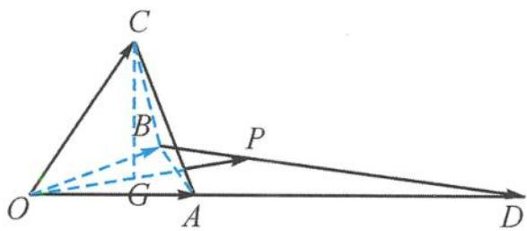

> [!faq]- 《浙大优辅《高中数学新体系 立体几何的秘密》》例题解析
>
> > [!success]- **【答案】** D
>
> > [!note]- **【分析】**
> > 本题未单列分析。
>
> > [!note]- **【解析】**
> > 解答 易得 $e_1, e_2, e_3$ 是空间中两两夹角为 $60^\circ$ 的单位向量. 如图 4.3-2, 构造棱长为 1 的正四面体 $O-ABC$ , 使得
> > $$
> > \overrightarrow {O A} = e _ {1}, \overrightarrow {O B} = e _ {2}, \overrightarrow {O C} = e _ {3}.
> > $$
> > 在射线 OA 上取点 D, 使得
> > $$
> > \overrightarrow {O D} = 3 \overrightarrow {O A} = 3 e _ {1}.
> > $$
> > 
> > 设 $b = \overrightarrow{OP}$ ，则
> > 图4.3-2
> > $$
> > \boldsymbol {b} = \overrightarrow {O P} = \lambda \overrightarrow {O D} + (1 - \lambda) \overrightarrow {O B}, \lambda \in \mathbf {R}.
> > $$
> > 由三点共线知, 点 P 在直线 BD 上. 由定义知 $e_{3}$ 在 b 方向上的投影
> > $$
> > \left| \boldsymbol {e} _ {3} \right| \cos \langle \boldsymbol {b}, \boldsymbol {e} _ {3} \rangle = \cos \langle \boldsymbol {b}, \boldsymbol {e} _ {3} \rangle = \cos \langle \overrightarrow {O P}, \overrightarrow {O C} \rangle .
> > $$
> > 作点 C 在平面 OAB 上的射影 G. 由最小角定理知, 当且仅当向量 $\overrightarrow{OP}$ 与向量 $\overrightarrow{OG}$ 同向时, $\langle\overrightarrow{OP},\overrightarrow{OC}\rangle$ 最小, $\cos\langle\overrightarrow{OP},\overrightarrow{OC}\rangle$ 最大, 即
> > $$
> > \cos \langle \overrightarrow {O P}, \overrightarrow {O C} \rangle_ {\max} = \cos \langle \overrightarrow {O G}, \overrightarrow {O C} \rangle = \frac {\sqrt {3}}{3}.
> > $$
> >
> > 故选 **D**.
