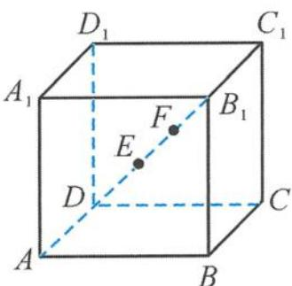

> [!faq]- 《浙大优辅《高中数学新体系 立体几何的秘密》》例题解析
>
> > [!success]- **【答案】** C
>
> > [!note]- **【分析】**
> > 本题未单列分析。
>
> > [!note]- **【解析】**
> > 解答 设
> > $$
> > x = \overrightarrow {O P}, y = \overrightarrow {O Q}, \frac {b - a}{2} = \overrightarrow {O M}, \frac {c - a}{2} = \overrightarrow {O N}.
> > $$
> > 由 $x \cdot (x + a) = x \cdot b$ 得 $\left|x - \frac{b - a}{2}\right| = \frac{1}{2}$ , 即
> > $$
> > \mid \overrightarrow {O P} - \overrightarrow {O M} \mid = \frac {1}{2}, \mid \overrightarrow {M P} \mid = \frac {1}{2},
> > $$
> > 所以点 P 在以 M 为球心, 半径 $r_{1} = \frac{1}{2}$ 的球面上运动.
> > 同理，由 $y \cdot (y + a) = y \cdot c$ 得 $\left|y - \frac{c - a}{2}\right| = \frac{\sqrt{3}}{2}$ ，即
> > $$
> > | \overrightarrow {O Q} - \overrightarrow {O N} | = \frac {\sqrt {3}}{2}, | \overrightarrow {N Q} | = \frac {\sqrt {3}}{2},
> > $$
> > 所以点 Q 在以 N 为球心, 半径 $r_{2} = \frac{\sqrt{3}}{2}$ 的球面上运动.
> > 因为球心距 $|\overrightarrow{MN}| = \left|\frac{\pmb{b} - \pmb{c}}{2}\right| = \frac{\sqrt{3}}{2}$ , 因此
> > $$
> > \mid x - y \mid = \mid \overrightarrow {O P} - \overrightarrow {O Q} \mid = \mid \overrightarrow {P Q} \mid .
> > $$
> > 而
> > $$
> > | \overrightarrow {P Q} | _ {\max} = r _ {1} + r _ {2} + | \overrightarrow {M N} | = \frac {1}{2} + \sqrt {3},
> > $$
> > 所以 $|x - y|$ 的最大值为 $\frac{1}{2} +\sqrt{3}$ ，故选C.
> > 引申 如图 4.3-3, 在正方体 $ABCD-A_{1}B_{1}C_{1}D_{1}$ 中, 已知 $AB = 3\sqrt{3}$ , 点 E, F 在线段 $DB_{1}$ 上, 且 DE = EF = $FB_{1}$ , 点 M 是正方体表面上的动点, 点 P, Q 是空间中的两个动点. 若 $\frac{|PE|}{|PF|} = \frac{|QE|}{|QF|} = 2$ 且 $|PQ| = 4$ , 则 $\overrightarrow{MP} \cdot \overrightarrow{MQ}$ 的最小值为 \_\_\_\_.
> > 
> > 图4.3-3
> > 解答 设 N 为 $FB_{1}$ 的一个三等分点(靠近点 F)，由于 $\frac{|PE|}{|PF|} = \frac{|QE|}{|QF|} = 2$ ，则点 P, Q 在以 N 为球心、2 为半径的球面上运动.
> > 因为 PQ = 4, 所以 PQ 为球 N 的直径. 由极化恒等式得
> > $$
> > \overrightarrow {M P} \cdot \overrightarrow {M Q} = \left(\frac {\overrightarrow {M P} + \overrightarrow {M Q}}{2}\right) ^ {2} - \left(\frac {\overrightarrow {M P} - \overrightarrow {M Q}}{2}\right) ^ {2} = | \overrightarrow {M N} | ^ {2} - 4.
> > $$
> > 故求 $\overrightarrow{MP}\cdot\overrightarrow{MQ}$ 的最小值,只需求 $\left|\overrightarrow{MN}\right|$ 的最小值.而
> > $$
> > | \overrightarrow {M N} | _ {\min} = \frac {2}{9} | \overrightarrow {A B} | = \frac {2 \sqrt {3}}{3},
> > $$
> > 所以
> > $$
> > \overrightarrow {M P} \cdot \overrightarrow {M Q} = | \overrightarrow {M N} | ^ {2} - 4 \geqslant - \frac {8}{3}.
> > $$
> > 综合上述, $\overrightarrow{MP}\cdot\overrightarrow{MQ}$ 的最小值为 $-\frac{8}{3}$ .
> > 点评 代数与几何比翼双飞,我们数学学习才能走得更远.对于空间图形的学习需要几何知识作为支撑,但也少不了代数特别是向量的帮衬,双剑合璧,相映生辉.
