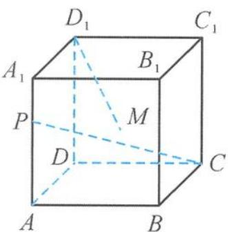

<!-- question-source:start -->
5. 如图, 在正方体 $ABCD-A_{1}B_{1}C_{1}D_{1}$ 中, 已知 $\overrightarrow{AP}=2\overrightarrow{PA_{1}}$ , 点 $M$ 是侧面 $AA_{1}B_{1}B$ 内的动点. 若 $D_{1}M \perp CP$ , 则点 $M$ 的轨迹是 ( ).

A. 线段
B. 圆弧

C. 椭圆的一部分
D. 抛物线的一部分

第5题图
<!-- question-source:end -->

![[Q00036085A1]]
