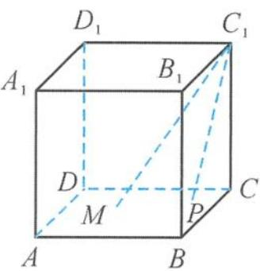

<!-- question-source:start -->
6. 如图, 在棱长为 1 的正方体 $ABCD-A_{1}B_{1}C_{1}D_{1}$ 中, 点 $M$ 是底面正方形 $ABCD$ 的中心, 点 $P$ 是底面 $ABCD$ 所在平面内的一个动点, 且满足 $\angle MC_{1}P = 30^{\circ}$ , 则动点 $P$ 的轨迹为 ( ).

A. 圆
B. 抛物线
C. 双曲线
D. 椭圆

<!-- question-source:end -->

![[Q00036086A1]]
