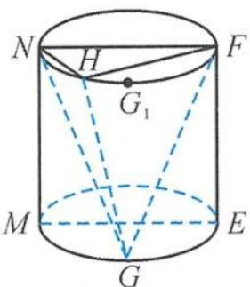

<!-- question-source:start -->
13. 如图, 圆柱 $W$ 的底面半径为 1、高为 2, 平面 MNFE 是轴截面, $G, G_{1}$ 分别是圆弧 $ME, NF$ 的中点, $H$ 在劣弧 $NG_{1}$ 上 (异于 $N, G_{1}$ ), $H, G, G_{1}$ 在平面 MNFE 的同侧. 记二面角 $G-NH-F, G-FH-N$ 的大小分别为 $\alpha, \beta$ , 则 $\tan \alpha - \tan \beta$ 的取值范围是 \_\_\_\_.

第13题图
<!-- question-source:end -->

![[Q00036093A1]]
