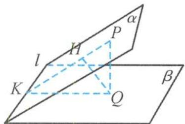

<!-- question-source:start -->
6. 解答 如答图, 过点 Q 作 $QK \perp l$ , 连接 PK,

第6题答图

则 $\angle PKQ = 60^{\circ}, PQ = \sqrt{3}$ ,

从而 QK = 1, PK = 2.

根据等面积法得点 $Q$ 到平面 $\alpha$ 的距离 $QH = \frac{1 \times \sqrt{3}}{2} = \frac{\sqrt{3}}{2}$ .
<!-- question-source:end -->

![[Q00036101A1]]
