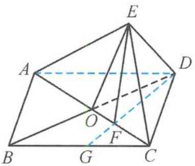

<!-- question-source:start -->
9. 解答 如答图, 过点 D 作 AC 的垂线, 交 AC 于点 F, 交 BC 于点 G, 则 $\beta = \angle EFG$ , 且 $\angle EDF$ 为 ED 与平面 ABCD 的线面角.

由最小角定理知 $\angle EDF < \angle EDO, \angle EDF < \angle EDA$ .

又 $\beta = 2\angle EDF, \alpha = 2\angle EDO, \gamma = \angle EDA,$

所以 $\beta < \alpha, \beta < 2\gamma.$

故选D.

第9题答图
<!-- question-source:end -->

![[Q00036104A1]]
