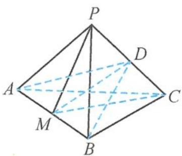
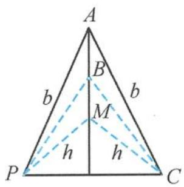

<!-- question-source:start -->
12. 解答 如答图(a), 取 $PC$ 的中点 $D$ , 连接 $AD, BD$ .

答图(a)

答图(b)
第12题

由 $PB = BC = a, PA = AC = b$ ，易知 $BD \perp PC, AD \perp PC$ ，故可得 $PC \perp$ 平面 $ABD$ .
作 $PM \perp AB$ 于点 $M$ ，由 $\triangle ABP \cong \triangle ABC$ ，可得 $CM \perp AB, \angle PMC = \alpha$ .
又 $PM = CM = h < a < b$ ，
由答图(b)可得

$\frac{\alpha}{2} = \frac{\angle PMC}{2} >\frac{\angle PBC}{2} >\frac{\angle PAC}{2},$ 所以 $2\alpha >\angle PAC + \angle PBC,$ $\alpha +\angle PCA + \angle PCB$ $> \frac{\angle PBC}{2} +\frac{\angle PAC}{2} +\angle PCA + \angle PCB$ $= \frac{\angle PBC}{2} +\angle PCB + \frac{\angle PAC}{2} +\angle PCA = \pi .$ 故选C.
<!-- question-source:end -->

![[Q00036107A1]]
