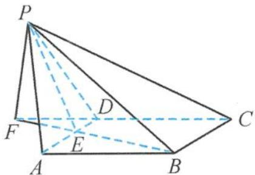

<!-- question-source:start -->
13. 解答 如答图, 取 $AD$ 的中点 $E$ , 连接 $BE$ 并延长, 过点 $P$ 作 $PF \perp BE$ 于点 $F$ . 因为 $PA = PD$ , 所以 $PE \perp AD$ . 因为 $\triangle ABD$ 为正三角形, 所以 $BE \perp AD$ , 故 $AD \perp$ 平面 $PEB$ (即 $PFB$ ), $PE \perp AD$ . 又 $PF \perp BF$ , 所以 $PF \perp$ 平面 $ABCD$ , 可得 $PF = 2 \cdot \sin 30^\circ = 1$ . 在 $\triangle PBE$ 中, 由余弦定理得 $PE = \frac{\sqrt{7}}{2}$ , 由勾股定理得 $EF = \frac{\sqrt{3}}{2}$ , 与 $BE$ 的长度相同, 所以点 $F$ 在 $CD$ 的延长线上, 所以平面 $PCF$ 与平面 $ABCD$ 垂直,

故平面 PCF 与平面 ABCD 垂直.

二面角 P-CD-A 的大小为 $90^{\circ}$ ，正弦值为 1.

第13题答图
<!-- question-source:end -->

![[Q00036108A1]]
