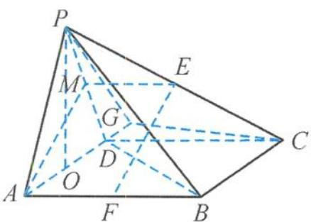
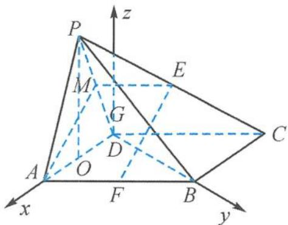
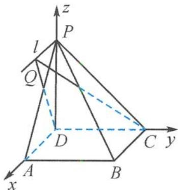

<!-- question-source:start -->
14. 解答 (1) 取 $PD$ 的中点 $M$ , 连接 $AM, ME$ . 已知 $AF \parallel ME \parallel DC$ , 且 $AF = ME = \frac{1}{2} DC$ , 所以四边形 $AFEM$ 是平行四边形, $EF \parallel AM$ . 又 $EF \not\subset$ 平面 $PAD, AM \subset$ 平面 $PAD$ , 所以 $EF$ 平面 $PAD$ .

（Ⅱ）解法一 如答图(a)，取 $AD$ 的中点 $O$ ，连接 $PO$ . 因为 $PA = AD = PD = 2, PO \perp AD,$

第 14 题答图(a)

又侧面 $PAD \perp$ 底面 $ABCD$ , 所以 $PO \perp$ 平面 $ABCD, PO \perp BD$ . 又因为 $AP \perp BD$ , 所以 $BD \perp$ 平面 $PAD, BD \perp AD$ . 又 $\angle BAD = 60^\circ$ , 所以 $AB = 2AD = 4$ . 过点 $C$ 作 $CG \perp AD$ 于点 $G$ , 连接 $PG$ , 由平面 $PAD \perp$ 平面 $ABCD$ 知, $CG \perp$ 平面 $PAD$ , 所以 $\angle CPG$ 是直线 $PC$ 与平面 $PAD$ 所成的角. 又 $CG = 2\sqrt{3}, PG = 2\sqrt{3}$ , 所以 $\angle CPG = 45^\circ$ . 故直线 $PC$ 与平面 $PAD$ 所成角为 $45^\circ$ . 解法二 如答图(b), 取 $AD$ 的中点 $O$ , 连接 $PO$ .

因为 PA = AD = PD
= 2, PO ⊥ AD,
又侧面 PAD ⊥ 底面
ABCD, 所以 PO ⊥ 平面
ABCD, PO ⊥ BD, .

第 14 题答图(b)

因为 $AP \perp BD$ ，所以 $BD\perp$ 平面PAD，BD $\perp AD.$

又 $\angle BAD = 60^{\circ}$ , 所以 $AB = 2AD = 4$ . 以 $D$ 为原点, 射线 $DA, DB$ 分别为 $x$ 轴、 $y$ 轴建立如答图 (b) 所示的空间直角坐标系, 则 $D(0,0,0), A(2,0,0), B(0,2\sqrt{3},0), C(-2,2\sqrt{3},0), P(1,0,\sqrt{3})$ , 则 $\overrightarrow{CP} = (3, -2\sqrt{3}, \sqrt{3})$ . 又平面 $PAD$ 的法向量 $n = (0,1,0)$ , 设直线 $PC$ 与平面 $PAD$ 所成的角为 $\theta$ , 则 $\sin \theta = \frac{|\overrightarrow{CP} \cdot n|}{|\overrightarrow{CP}| |n|} = \frac{\sqrt{2}}{2}$ . 所以直线 $PC$ 与平面 $PAD$ 所成的角为 $45^{\circ}$ . 15. 证明 (1) 在正方形 $ABCD$ 中, $AD \parallel BC$ . 因为 $AD \not\subset$ 平面 $PBC, BC \subset$ 平面 $PBC$ , 所以

$AD \parallel$ 平面 $PBC$ . 因为 $AD \subset$ 平面 $PAD$ , 平面 $PAD \cap$ 平面 $PBC = l$ , 所以 $AD \parallel l$ . 因为在四棱锥 $P-ABCD$ 中, 底面 $ABCD$ 是正方形, 所以 $AD \perp DC, l \perp DC$ , 且 $PD \perp$ 平面 $ABCD$ , 所以 $AD \perp PD, l \perp PD$ . 因为 $CD \cap PD = D$ , 所以 $l \perp$ 平面 $PDC$ . (2) 建立如答图所示的空间直角坐标系 $D-xyz$ .

第15题答图

已知 $PD = AD = 1$ ，则有 $D(0,0,0),C(0,1,0)$ $A(1,0,0),P(0,0,1),B(1,1,0).$ 设 $Q(m,0,1)$ ，则有 $\overrightarrow{DC} = (0,1,0),\overrightarrow{DQ} = (m,0,$ $1),\overrightarrow{PB} = (1,1, - 1).$ 设平面 $QCD$ 的法向量 $\pmb {n} = (x,y,z)$ 则 $\left\{ \begin{array}{l}\overrightarrow{DC}\cdot \pmb {n} = 0,\\ \overrightarrow{DQ}\cdot \pmb {n} = 0, \end{array} \right.$ 即 $\left\{ \begin{array}{l}y = 0,\\ mx + z = 0. \end{array} \right.$ 令 $x = 1$ ，则 $z = -m.$ 所以平面 $QCD$ 的一个法向量 $\pmb {n} = (1,0, - m)$ 则 $\cos \langle \overrightarrow{PB},\pmb {n}\rangle = \frac{|\overrightarrow{PB}\cdot\pmb{n}|}{|\overrightarrow{PB}||\pmb{n}|} = \frac{1 + 0 + m}{\sqrt{3}\cdot\sqrt{m^2 + 1}}.$

因为直线的方向向量与平面法向量所成角的余弦值的绝对值即为直线与平面所成角的正弦值，所以直线与平面所成角的正弦值等于 $\cos \langle \overrightarrow{PB}, n \rangle = \frac{|1 + m|}{\sqrt{3} \cdot \sqrt{m^2 + 1}} = \frac{\sqrt{3}}{3} \cdot \sqrt{\frac{1 + 2m + m^2}{m^2 + 1}} = \frac{\sqrt{3}}{3} \cdot \sqrt{1 + \frac{2m}{m^2 + 1}} \leqslant \frac{\sqrt{3}}{3} \cdot \sqrt{1 + \frac{2|m|}{m^2 + 1}} \leqslant \frac{\sqrt{3}}{3} \cdot \sqrt{1 + 1} = \frac{\sqrt{6}}{3}$ ，当且仅当 $m = 1$ 时取等号。所以直线 $PB$ 与平面 $QCD$ 所成角的正弦值的最大值为 $\frac{\sqrt{6}}{3}$ 。
<!-- question-source:end -->

![[Q00036109A1]]
