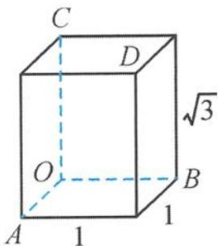

<!-- question-source:start -->
1. 解答 把图形补成长、宽、高分别为 $1,1,\sqrt{3}$ 的长方体(如答图).

① $V=\frac{1}{3}\left(\frac{1}{2}\times1\times1\right)\sqrt{3}=\frac{\sqrt{3}}{6}$ ，故A正确；

② 经过 $A, B, C, D$ 四点的球的直径为 $\sqrt{1^2 + 1^2 + (\sqrt{3})^2} = \sqrt{5}$ , 故 B 正确;

④ 平移 AD, 易求直线 AD, OB 所成的角为 $60^{\circ}$ , 故 D 正确.

故选 ABD.

第1题答图
<!-- question-source:end -->

![[Q00036110A1]]
