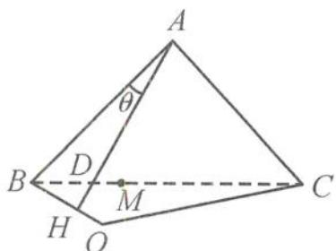

<!-- question-source:start -->
6. 解答 由题意知 $BC = \sqrt{2}$ , 所以 $\triangle ABC$ 为等腰直角三角形, 且 $\angle BAC = 90^{\circ}$ .

如答图, 过点 B 作 AD 的垂线, 垂足为 H, 则射影 O 在 OH 上.

第6题答图

因为二面角 $B^{\prime} - AD - C$ 的度数为 $60^{\circ}$ ，所以 $BH = 2HO.$ 设 $\angle BAD = \theta$ ，则 $0 < \theta \leqslant \angle BAM < 45^{\circ}$ 且 $\sin \angle BAM = \frac{1}{\sqrt{5}},\cos \angle BAM = \frac{2}{\sqrt{5}}.$ 又 $BH = AB\sin \theta = \sin \theta ,$ $BO = \frac{3}{2} BH = \frac{3}{2}\sin \theta ,$ 在 $\triangle BOC$ 中，由余弦定理得 $OC^2 = (\sqrt{2})^2 +\left(\frac{3}{2}\sin \theta\right)^2 -2\cdot \sqrt{2}\cdot \frac{3}{2}\sin \theta \cdot$ $\cos (45^{\circ} - \theta)$ $= 2 - \frac{3}{4}\sin^{2}\theta -3\sin \theta \cdot \cos \theta$ $= \frac{3}{8}\cos 2\theta -\frac{3}{2}\sin 2\theta +\frac{13}{8},$ 其在 $2\theta \in (0,90^{\circ})$ 上递减，当 $\sin 2\theta = \frac{4}{5},\cos 2\theta = \frac{3}{5}$ 时，OC取到最小值 $\frac{\sqrt{65}}{10}.$
<!-- question-source:end -->

![[Q00036115A1]]
