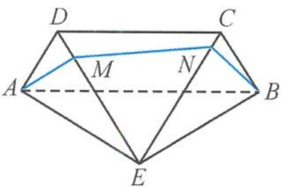

<!-- question-source:start -->
8. 解答 因为 $AE = BE = 2\sqrt{3}, AB = 4$ 所以 $\cos \angle AEB = \frac{24 - 16}{2 \times 2\sqrt{3} \times 2\sqrt{3}} = \frac{1}{3}$ .

因为 $\angle AEB$ 为三角形内角，
所以 $\sin \angle AEB = \sqrt{1 - \frac{1}{9}} = \frac{2\sqrt{2}}{3}$ 设点 $E$ 到 $AB$ 的距离为 $d$ ，
则 $\frac{1}{2} \times d \times 4 = \frac{1}{2} \times 2\sqrt{3} \times 2\sqrt{3} \times \frac{2\sqrt{2}}{3}$ 故 $d = 2\sqrt{2}$ 因为该几何体的侧视图的面积为 $2\sqrt{2}$ 故 $\frac{1}{2} \times AD \times 2\sqrt{2} = 2\sqrt{2}, AD = 2.$

四边形ABCD是矩形， $AD\perp AB$ ，而平面ABCD⊥平面ABE， $AD\subset$ 平面ABCD，平面ABCD∩平面 $ABE = AB$ ，故 $AD\perp$ 平面ABE.

而 $AE \subset$ 平面 $ABE$ , 故 $AD \perp AE$ .
所以 $DE = \sqrt{4 + 12} = 4, \angle DEA = 30^{\circ}$ .
同理 $CE = 4, \angle CEB = 30^{\circ}$ .

将平面 ADE、平面 DCE、平面 BCE 展开至一个平面上, 如答图.

第8题答图

$AM + MN + NB \geqslant AB$ , 当且仅当点 A, M, N, B 共线时等号成立.

因为 $DC = DE = EC = 4$ ，所以 $\angle DEC = 60^{\circ}$ 所以 $\angle AEB = 120^{\circ}$

$$
A E = B E = 2 \sqrt {3}
$$

故 $AB = \sqrt{12 + 12 - 2 \times 2\sqrt{3} \times 2\sqrt{3} \times \left(-\frac{1}{2}\right)}$ $= 6.$

从而 $AM + MN + NB$ 的最小值为 6, 答案为 6.
<!-- question-source:end -->

![[Q00036117A1]]
