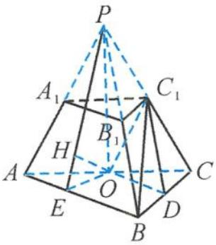
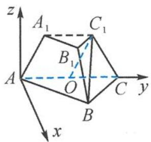
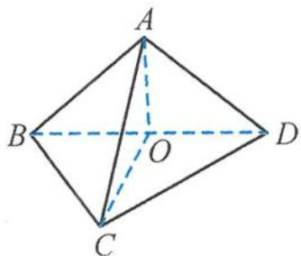

<!-- question-source:start -->
9. 证明 （Ⅰ）由题意可知 $A_{1}C_{1} = \frac{1}{2} AC = AO$ 且 $A_{1}C_{1} \parallel AO$ , 即四边形 $AA_{1}C_{1}O$ 为平行四边形. 所以 $OC_{1} \parallel AA_{1}, OC_{1} \parallel$ 平面 $ABB_{1}A$ .

（Ⅱ）解法一 将三棱台还原为三棱锥 P-ABC，如答图(a)所示.

连接 $PO, \angle ABC = 90^{\circ}$ , 则 $OA = OB = OC$ , $PA = PB = PC$ .

由题意可知 $PO \perp$ 平面 $ABC$ , 取 $AB$ 的中点 $E$ , 则 $OE \perp AB$ .

连接 $PE$ , 则 $PE \perp AB$ ,

从而 $AB \perp$ 平面 $POE$ , 平面 $PAB \perp$ 平面 $POE$ .

过点 $O$ 作 $OH \perp PE$ , 即 $OH$ 就是点 $O$ 到平面 $PAB$ 的距离 $h$ .

因为 $OC_{1} //$ 平面 $ABB_{1}A_{1}$ , 所以点 $C_{1}$ 到平面 $PAB$ 的距离等于点 $O$ 到平面 $PAB$ 的距离 $h$ .

在 $\triangle OPE$ 中, $OE = 1$ , $PO = 2\sqrt{3}$ ,

则 $PE = \sqrt{13}$ , $h = OH = \frac{2\sqrt{39}}{13}$ .

又因为 $BC_{1} = \sqrt{6}$ , 设直线 $BC_{1}$ 与平面 $ABB_{1}A_{1}$ 所成的角为 $\theta$ , 则 $\sin \theta = \frac{\frac{2\sqrt{39}}{13}}{\sqrt{6}} = \frac{\sqrt{26}}{13}$ .

答图(a)

第9题
答图(b)

解法二 建立如答图(b)所示的空间直角坐标系 A-xyz，
则 $A(0,0,0)$ , $B(\sqrt{3},3,0)$ , $C(0,4,0)$ .
在梯形 $ACC_{1}A_{1}$ 中， $AA_{1}=A_{1}C_{1}=C_{1}C=2$ , AC = 4,
则 $A_{1}(0,1,\sqrt{3})$ , $C_{1}(0,3,\sqrt{3})$ .
设 $n=(x,y,z)$ 是平面 $ABB_{1}A_{1}$ 的法向量，
则 $\left\{\begin{aligned}\overrightarrow{AB}\cdot\boldsymbol{n}&=\sqrt{3}x+3y=0,\\ \overrightarrow{AA_{1}}\cdot\boldsymbol{n}&=y+\sqrt{3}z=0,\end{aligned}\right.$ 解得 $\left\{\begin{aligned}x&=-\sqrt{3}y,\\ z&=-\frac{y}{\sqrt{3}}.\end{aligned}\right.$ 取 $y = -\sqrt{3}$ ，则 $n = (3, -\sqrt{3}, 1)$ , $\overrightarrow{BC}=(-\sqrt{3},0,\sqrt{3})$ .
设 $BC_{1}$ 与平面 $ABB_{1}A_{1}$ 所成的角为 $\theta$ ,

则 $\sin \theta = |\cos \langle \overrightarrow{BC}, n\rangle| = \frac{2\sqrt{3}}{\sqrt{13} \times \sqrt{6}} = \frac{\sqrt{26}}{13}$ . 10. 解答 (I) 解法一 如答图, 取 $BD$ 的中点 $O$ , 连接 $OA, OC$ , 则 $OC \perp BD$ .

第10题答图

因为 BC = DC, $\angle ACB = \angle ACD = \theta$ , AC = AC,
所以 $\triangle ABC \cong \triangle ADC$ ，所以 AB = AD, AO $\perp BD$ , $AO \cap CO = O, AO, CO \subset$ 平面 AOC,
所以 $BD \perp$ 平面 AOC.
又 $AC \subset$ 平面 AOC，所以 $BD \perp AC$ .
解法二 同解法一得到 AB = AD，所以 $\overrightarrow{BD} \cdot \overrightarrow{AC} = \frac{|\overrightarrow{BC}|^{2} + |\overrightarrow{AD}|^{2} - |\overrightarrow{AB}|^{2} - |\overrightarrow{CD}|^{2}}{2} = 0,$ 从而得证.
（Ⅱ）过点 A 作 AH ⊥ 平面 BCD，垂足为 H.
因为 $\angle ACB = \angle ACD = \theta$ ，所以点 H 在 $\angle BCD$ 的内角平分线上，即在 CO 上.
选①, $\theta = 60^{\circ}$ , 设 $\angle ACO = \beta$ ,
由三余弦定理得 $\cos 60^{\circ} = \cos \beta \cos 45^{\circ}$ ,
解得 $\beta = 45^{\circ}$ .
设点 B 到平面的距离为 h，
由体积相等得 $V_{A-BCD} = V_{B-ACD}$ ，即 $\frac{1}{3}(AC\sin45^{\circ})\left(\frac{1}{2}\times1\times1\right)$ $=\frac{1}{3}h\left(\frac{1}{2}\times AC\sin60^{\circ}\right),$ 解得 $h=\frac{\sqrt{6}}{3}$ ，所以 $\sin\alpha=\frac{h}{BC}=\frac{\sqrt{6}}{3}$ .
选②，则 $\angle ACO = \beta$ 为直线与平面所成的角，即 $\beta = 45^{\circ}$ .
以 CD 为 x 轴，CB 为 y 轴，过点 C 且垂直于平面

BCD 的射线为 z 轴, 建立空间直角坐标系, 得 $\overrightarrow{CA} = (t, t, \sqrt{2}t)$ .
设平面的法向量为 $\boldsymbol{n} = (x_{0}, y_{0}, z_{0})$ ,
则 $\left\{\begin{aligned}\boldsymbol{n}\cdot\overrightarrow{CD}&=x_{0}=0,\\ \boldsymbol{n}\cdot\overrightarrow{CA}&=tx_{0}+ty_{0}+\sqrt{2}tz_{0}=0.\end{aligned}\right.$ 取 $n=(0,-\sqrt{2},1)$ ，因为 $\overrightarrow{CB}=(0,1,0)$ ，
所以 $\sin\alpha=|\sin\langle\overrightarrow{CB},n\rangle|=\frac{\sqrt{6}}{3}$ .
选③,作AM⊥CD,垂足为M,连接HM.
由于AH⊥平面BCD,由三垂线定理得HM⊥CD,
所以∠HMA是二面角A-CD-B的平面角.
因为HM∥BC,所以∠HMA也是直线BC与平面ACD所成的角,
所以 $\cos\alpha=\frac{\sqrt{3}}{3}$ , 即 $\sin\alpha=\frac{\sqrt{6}}{3}$ .
<!-- question-source:end -->

![[Q00036118A1]]
