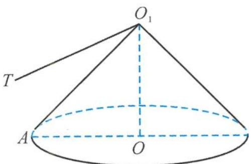

<!-- question-source:start -->
8. 解答 取 $PQ$ 的中点 $M$ , 连接 $O_1M, OM$ , 则 $O_1M \perp PQ$ .

所以 $PQ \perp$ 平面 $OO_1M$ , 且 $O_1M = \frac{\sqrt{6}}{3}$ .

过点 $O_1$ 作 $O_1T \perp MO$ , 易得 $O_1T \perp$ 平面 $OPQ$ , 所以 $\overrightarrow{O_1T}$ 为平面 $OPQ$ 的一个法向量.

这样就把原问题转化求直线 $AO_1$ 与平面 $OPQ$ 的法向量 $\overrightarrow{O_1T}$ 所成角的余弦值的范围问题了.

记 $\alpha = \angle TO_1O, \beta = \angle AO_1O$ , 则 $\alpha = \frac{\pi}{3}, \sin \beta = \frac{\sqrt{3}}{3}$ .

因此 $O_1A$ 在一个半顶角为 $\beta$ 的圆锥曲面上运动, 如答图.

因为 $\sin \theta = |\cos \langle \overrightarrow{O_1T}, \overrightarrow{O_1A} \rangle|$ ,

又 $\cos (\alpha - \beta) = \frac{3 + \sqrt{6}}{6}, \cos (\alpha + \beta) = \frac{\sqrt{6} - 3}{6} < 0$ ,

所以选B.

第8题答图
<!-- question-source:end -->

![[Q00036124A1]]
