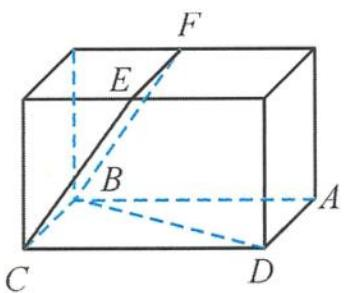

<!-- question-source:start -->
11. 解答 如答图, 把图形放到一个长方体中.

由最小角定理知, 直线 BD 与 PQ 所成角的最小值是直线 BD 与平面 BCEF 所成的角.

设正方形 ABCD 的边长为 2，则 $BD = 2\sqrt{2}$ .

点 D 到平面 BCEF 的距离 $h = \sqrt{2}$ ,

所以 $\sin \theta = \frac{h}{BD} = \frac{1}{2}$ , 即 $\theta = \frac{\pi}{6}$ .

而最大角显然为 $\frac{\pi}{2}$ ，故直线 BD 与 PQ 所成角的取值范围是 $\left[\frac{\pi}{6}, \frac{\pi}{2}\right]$ .

第11题答图
<!-- question-source:end -->

![[Q00036127A1]]
