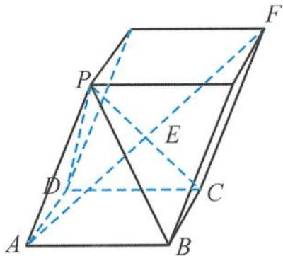

<!-- question-source:start -->
6. 解答 利用空间向量的平行六面体分解, 将图形复原, 如答图. $\overrightarrow{AE}=\frac{1}{2}\overrightarrow{AF}=\frac{1}{2}(\overrightarrow{AB}+\overrightarrow{AD}+\overrightarrow{AP})$ ,
则 $x = \frac{1}{2}, 2y = \frac{1}{2}, 3z = \frac{1}{2}$ ,
所以 $x + y + z = \frac{11}{12}$ . 故选 B.

第6题答图
<!-- question-source:end -->

![[Q00036134A1]]
