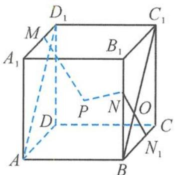

<!-- question-source:start -->
8. 解答 因为 $\overrightarrow{AP} = x\overrightarrow{AC_1} + y\overrightarrow{BD_1}$ , 所以点 $P$ 在平面 $ABC_{1}D_{1}$ 内, 如答图.

第8题答图

在棱 BC 上取点 $N_{1}$ ，使得 $\overrightarrow{BN_{1}} = \sqrt{3} \cdot \overrightarrow{N_{1}C}$ .
又 $\overrightarrow{BN}=\sqrt{3}\overrightarrow{NB_{1}}$ ，得到 $NN_{1}\parallel B_{1}C.$ 而 $B_{1}C\perp$ 平面 $ABC_{1}D_{1}$ ,
所以 $NN_{1}\perp$ 平面 $ABC_{1}D_{1}$ .
又 $NO = ON_{1}$ ，从而点 N 与点 $N_{1}$ 关于平面 $ABC_{1}D_{1}$ 对称，得 $|NP|=|PN_{1}|$ .
因此 $|MP|+|NP|=|MP|+|PN_{1}|\geqslant|MN_{1}|=\sqrt{2}$ . 故选 A.
<!-- question-source:end -->

![[Q00036136A1]]
