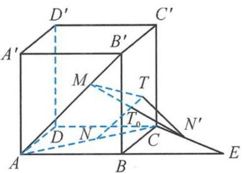

<!-- question-source:start -->
10. 解答 如答图, 设点 A 关于 BC 的对称点为 E, 点 N 关于 BC 的对称点为 $N'$ .

第10题答图

记 d 为直线 $AB'$ 与 CE 之间的距离，

则 $|MT| + |NT| = |MT| + |N'T| \geqslant |MN'| \geqslant d.$

由 $CE \parallel DB$ 可知, 直线 $AB'$ 与 $CE$ 所成的角为 $60^\circ$ .

对四面体 $AB^{\prime} CE$ 有

$$
V _ {A B ^ {\prime} C E} = \frac {1}{3} \times \frac {1}{2} | A B ^ {\prime} | | C E | \sin 6 0 ^ {\circ} d = \frac {\sqrt {3}}{6} d,
$$

$$
V _ {A B ^ {\prime} C E} = \frac {1}{3} S _ {\triangle A C E} | B B ^ {\prime} |
$$

$$
= \frac {1}{3} \times \frac {1}{2} | A E | | B C | | B B ^ {\prime} | = \frac {1}{3},
$$

因此 $\frac{\sqrt{3}}{6}d=\frac{1}{3}$ ，故 $d=\frac{2\sqrt{3}}{3}$ .

所以 $|MT| + |NT|$ 的最小值为 $\frac{2\sqrt{3}}{3}$ ，故选 B.
<!-- question-source:end -->

![[Q00036152A1]]
