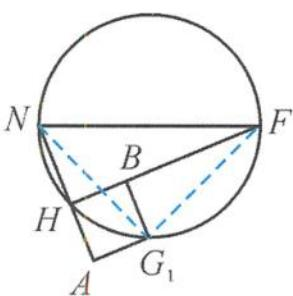

<!-- question-source:start -->
13. 解答 作 $G_{1}A \perp NH, G_{1}B \perp FH \Rightarrow \alpha = \angle G_{1}AG, \beta = \pi - \angle G_{1}BG \Rightarrow \tan \alpha - \tan \beta = \tan \angle G_{1}AG + \tan \angle G_{1}BG = \frac{2}{G_{1}A} + \frac{2}{G_{1}B}$ .

如答图， $\mathrm{Rt}\triangle NAG_{1} \cong \mathrm{Rt}\triangle FBG_{1}$ ，

则 $AG_{1} = BG_{1}$ .

原式 $= \frac{4}{G_1A}\in (4, + \infty),G_1A\in (0,1),$

从而 $\tan\alpha-\tan\beta$ 的取值范围是 $(4,+\infty)$ .

第 13 题答图
<!-- question-source:end -->

![[Q00036155A1]]
