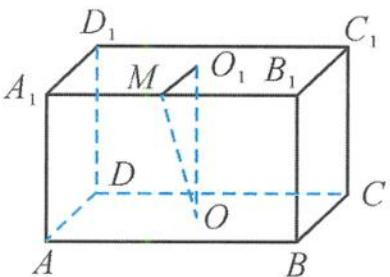

<!-- question-source:start -->
14. 解答 如答图, 设 $O_{1}$ 是底面 $A_{1}B_{1}C_{1}D_{1}$ 的中心, $M$ 为 $A_{1}B_{1}$ 的中点,

则 $A_{1}B_{1} \perp$ 平面 $MOO_{1}$ ，且 $\angle OMO_{1} = 45^{\circ}$ .

第 14 题答图

过点 $M$ 作球 $O$ 的切线，切点为 $P$ 易求得 $\tan \angle PMO = \frac{\sqrt{7}}{7}$ 则 $\frac{\pi}{4} -\angle PMO\leqslant \theta \leqslant \frac{\pi}{4} +\angle PMO,$ 所以 $\tan \theta \geqslant \tan \left(\frac{\pi}{4} -\angle PMO\right) = \frac{4 - \sqrt{7}}{3},$ 且 $\tan \theta \leqslant \tan \left(\frac{\pi}{4} +\angle PMO\right) = \frac{4 + \sqrt{7}}{3}.$ 故 $\tan \theta$ 的取值范围是 $\left[\frac{4 - \sqrt{7}}{3},\frac{4 + \sqrt{7}}{3}\right].$
<!-- question-source:end -->

![[Q00036156A1]]
