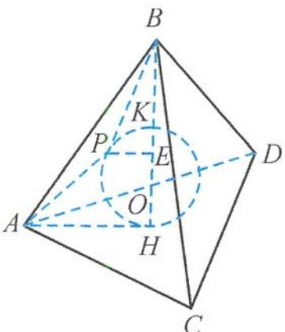

<!-- question-source:start -->
15. 解答 设正四面体 ABCD 的高为 h，每一个面的面积为 S，其内切球的半径为 r，

由等积法可得 $\frac{1}{3} Sh = 4 \cdot \frac{1}{3} Sr$ ，即 $r = \frac{1}{4} h$ .

如答图,设内切球的球心为 O, 连接 BO 并延长, 交平面 ACD 于点 H, 与内切球上方的交点设为 K. 过点 P 作 $PE \perp BH$ , 交 BH 于点 E, 连接 BP, AP.

第 15 题答图

在正三角形 ACD 中, $AH = \frac{2}{3} \times \frac{\sqrt{3}}{2} \times 12 = 4\sqrt{3}$ ,

所以 $BH = \sqrt{12^{2} - (4\sqrt{3})^{2}} = 4\sqrt{6}$ .

正四面体内切球的半径 $r = \frac{1}{4} h = \frac{1}{4} BH = \sqrt{6}$ 直径为 $2\sqrt{6}$ .

BP 的最小值为 $BK = 4\sqrt{6} - 2\sqrt{6} = 2\sqrt{6}$ .

同理,AP 的最小值为 $2\sqrt{6}$ .

由阿波罗尼斯球知，内切球是线段BH上以B，E为定点，空间中满足 $\frac{PB}{PE}=\lambda(\lambda\neq1)$ 的点P的集合。
设OE=x，因为 $BO=\frac{3}{4}\times4\sqrt{6}=3\sqrt{6},OH=0$ $\sqrt{6},\frac{KB}{KE}=\frac{HB}{HE}$ 所以 $\frac{2\sqrt{6}}{\sqrt{6}-x}=\frac{4\sqrt{6}}{\sqrt{6}+x}$ ，解得 $x=\frac{\sqrt{6}}{3}$ 所以 $\lambda=\frac{KB}{KE}=\frac{2\sqrt{6}}{\frac{2\sqrt{6}}{3}}=3$ 所以 $\frac{PB}{PE}=3$ 即 $\frac{1}{3}PB=PE,PA+\frac{1}{3}PB=PA+PE\geqslant AE.$

在 $\triangle AOE$ 中， $BO = AO = 3\sqrt{6}, OE = \frac{\sqrt{6}}{3}$ ， $\cos \angle AOE = -\cos \angle AOH = -\frac{OH}{AO} = -\frac{\sqrt{6}}{3\sqrt{6}} = -\frac{1}{3}$ ，所以 $AE = \sqrt{(3\sqrt{6})^2 + \left(\frac{\sqrt{6}}{3}\right)^2 - 2 \times 3\sqrt{6} \times \frac{\sqrt{6}}{3} \times \left(-\frac{1}{3}\right)} = \frac{4\sqrt{33}}{3}$ 。因此 $PA + \frac{1}{3}PB$ 的最小值为 $\frac{4\sqrt{33}}{3}$ 。故答案为 $2\sqrt{6}, \frac{4\sqrt{33}}{3}$ 。
<!-- question-source:end -->

![[Q00036157A1]]
