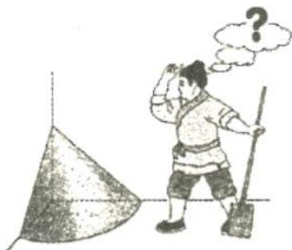
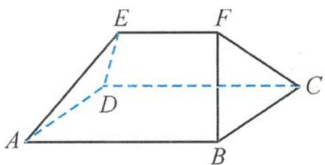
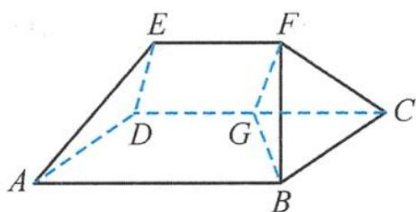
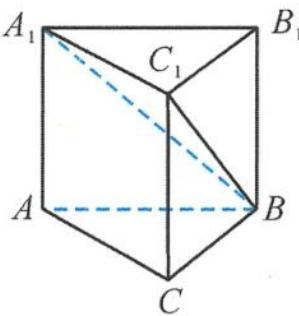

> [!faq]- 《浙大优辅《高中数学新体系 立体几何的秘密》》例题解析
>
> > [!success]- **【答案】** B
>
> > [!note]- **【分析】**
> > 本题未单列分析。
>
> > [!note]- **【解析】**
> > 
> > 图5.1-2
> > 解答 设地面圆弧的半径为 r，则 $\frac{\pi}{2}r = 9$ ，所以 $r = \frac{18}{\pi}$ ，即 r = 6。
> > 所以米堆的体积为
> > $$
> > V = \frac {1}{4} \times \frac {1}{3} \pi r ^ {2} h = \frac {1}{1 2} \times 3 \times 6 ^ {2} \times 6 = 5 4 (\text {尺} ^ {3}),
> > $$
> > 则有
> > $$
> > \frac {5 4}{1 . 6 2} = \frac {1 0 0}{3} \approx 3 3 (\text { 斛 }).
> > $$
> > 故选B.
> > 引申 1 我国古代数学名著《九章算术》中记载的“刍甍”是指底面为矩形,顶部只有一条棱的五面体.如图5.1-3,五面体 $ABCDEF$ 是一个“刍甍”,其中 $\triangle BCF$ 是正三角形, $AB = 2BC = 2EF$ ,有两个结论:① $AB // EF$ ;
> > - **②**：$BF \perp ED$ .则( ).
> > 
> > 图5.1-3
> > 解答 因为 $AB \parallel CD, CD$ 在平面 $CDEF$ 内, $AB$ 不在平面 $CDEF$ 内, 所以 $AB \parallel$ 平面 $CDEF$ . 又 $EF$ 在平面 $CDEF$ 内, 由于 $AB$ 在平面 $ABFE$ 内, 且平面 $ABFE \cap$ 平面 $CDEF = EF$ , 所以 $AB \parallel EF$ . 故①对.
> > 如图 5.1-4, 取 CD 的中点 G, 连接 BG, FG. 由 AB = CD = 2EF, 易知
> > $$
> > D E \parallel G F, \text {且} D E = G F.
> > $$
> > 不妨设 $EF = 1$ ，则
> > 
> > $$
> > B G = \sqrt {2} B C = \sqrt {2} E F = \sqrt {2}.
> > $$
> > 假设 $BF \perp ED$ ，则
> > 图5.1-4
> > $$
> > B F ^ {2} + F G ^ {2} = B G ^ {2},
> > $$
> > 即 $1 + FG^{2} = 2$ ，解得 $FG = 1$ .但 $FG$ 的长度不定，故假设不一定成立，即②不一定成立.故选B.
> > 引申 2 我国古代数学名著《九章算术》中有这样一些数学用语，“堑堵”意指底面为直角三角形,且侧棱垂直于底面的三棱柱,“阳马”指底面为矩形且有一条侧棱垂直于底面的四棱锥.现有一如图 5.1-5 所示的“堑堵” $ABC-A_{1}B_{1}C_{1}$ ,其中 $AC \perp BC$ .若 $AA_{1} = AB = 2$ ,当“阳
> > “ $B-A_{1}ACC_{1}$ 的体积最大时，“堑堵” $ABC-A_{1}B_{1}C_{1}$ 的表面积为( ).
> > A. $4 + 4\sqrt{2}$ B. $6 + 4\sqrt{2}$ C. $8 + 4\sqrt{2}$ D. $8 + 6\sqrt{2}$
> > 解答 设 AC = x, BC = y, 则
> > 
> > 图5.1-5
> > $$
> > x ^ {2} + y ^ {2} = 4.
> > $$
> > 由题意“阳马”的体积
> > $$
> > V = \frac {2}{3} x y \leqslant \frac {1}{3} (x ^ {2} + y ^ {2}) = \frac {4}{3},
> > $$
> > 当且仅当 $x = y = \sqrt{2}$ 时取等号，则“堑堵”的表面积
> > $$
> > S = 2 (x + y + 2) + 2 \times \frac {1}{2} x y = 4 \sqrt {2} + 6.
> > $$
> >
> > 故选 **B**.
