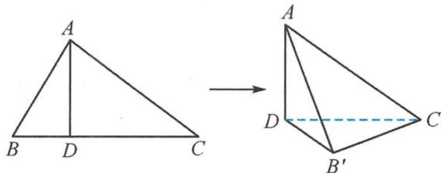
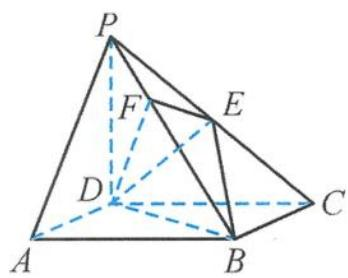
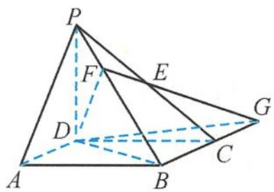
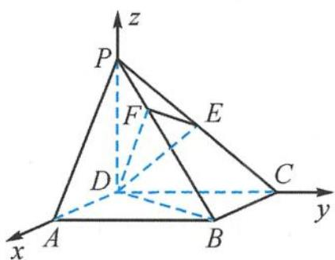

> [!faq]- 《浙大优辅《高中数学新体系 立体几何的秘密》》例题解析
>
> > [!success]- **【答案】** 详见解析
>
> > [!note]- **【分析】**
> > 本题未单列分析。
>
> > [!note]- **【解析】**
> > 
> > 图5.1-6
> > 解答 作 $B^{\prime}M \perp CD$ , 交 $CD$ 于点 $M$ . 因为 $AD \perp CD, AD \perp DB'$ 且 $CD \cap DB' = D$ , 所以 $AD \perp$ 平面 $DB^{\prime}C$ . 而 $AD \subset$ 平面 $ACD$ , 所以平面 $ACD \perp$ 平面 $DB^{\prime}C$ . 因为平面 $ACD \cap$ 平面 $DB^{\prime}C = DC$ , 且 $B^{\prime}M \perp CD$ , 所以 $B^{\prime}M \perp$ 平面 $ACD$ , 则 $\angle B^{\prime}DM$ 即为 $B^{\prime}D$ 与平面 $ADC$ 的夹角.
> > 在 Rt△ABC 中, 因为 AB = 3, AC = 4, 所以
> > $$
> > B C = \sqrt {A B ^ {2} + A C ^ {2}} = \sqrt {9 + 1 6} = 5, A D = \frac {A B \cdot A C}{B C} = \frac {3 \times 4}{5} = \frac {1 2}{5},
> > $$
> > 从而
> > $$
> > D C = \sqrt {A C ^ {2} - A D ^ {2}} = \sqrt {4 ^ {2} - \left(\frac {1 2}{5}\right) ^ {2}} = \frac {1 6}{5},
> > $$
> > 所以
> > $$
> > D B ^ {\prime} = B C - D C = 5 - \frac {1 6}{5} = \frac {9}{5}.
> > $$
> > 在 Rt△B'DC 中，
> > $$
> > \cos \angle B ^ {\prime} D M = \cos \angle B ^ {\prime} D C = \frac {D B ^ {\prime}}{D C} = \frac {\frac {9}{5}}{\frac {1 6}{5}} = \frac {9}{1 6}.
> > $$
> > 故答案为 $\frac{9}{16}$ .
> > 引申 在《九章算术》中, 将底面为长方形且有一条侧棱与底面垂直的四棱锥称为“阳马”, 将四个面都为直角三角形的四面体称为“鳖臑”.
> > 如图 5.1-7, 在“阳马”P-ABCD 中, 侧棱 PD ⊥ 底面 ABCD, 且 PD = CD, 过棱 PC 的中点 E 作 EF ⊥ PB, 交 PB 于点 F, 连接 DE, DF, BD, BE.
> > (I) 证明: $PB \perp$ 平面 $DEF$ . 试问四面体 $DBEF$ 是否为“鳖臑”? 若是, 写出其每个面的直角 (只需写出结论); 若不是, 说明理由.
> > 
> > 图5.1-7
> > （Ⅱ）若平面 DEF 与平面 ABCD 所成二面角的大小为 $\frac{\pi}{3}$ ，求 $\frac{DC}{BC}$ 的值.
> > 解答 解法一 （Ⅰ）因为 $PD \perp$ 底面 ABCD，所以 $PD \perp BC$ 。由底面 ABCD 为长方形，有 $BC \perp CD$ 。因为 $PD \cap CD = D$ ，所以 $BC \perp$ 平面 PCD。又 $DE \subset$ 平面 PCD，所以
> > $$
> > B C \perp D E.
> > $$
> > 因为 $PD = CD, E$ 是 $PC$ 的中点, 所以
> > $$
> > D E \perp P C.
> > $$
> > 因为 $PC \cap BC = C$ ，所以
> > $$
> > D E \perp \text { 平面 } P B C.
> > $$
> > 而 $PB \subset$ 平面 $PBC$ , 所以
> > $$
> > P B \perp D E.
> > $$
> > 又 $PB \perp EF, DE \cap EF = E$ , 所以
> > $$
> > P B \perp \text { 平面 } D E F.
> > $$
> > 由 $DE \perp$ 平面 $PBC, PB \perp$ 平面 $DEF$ , 可知四面体 $BDEF$ 的四个面都是直角三角形, 即四面体 $BDEF$ 是一个“鳖臑”, 其四个面的直角分别为 $\angle DEB, \angle DEF, \angle EFB, \angle DFB$ .
> > (II) 如图 5.1-8, 在平面 $PBC$ 内, 延长 $BC$ , 与 $FE$ 交于点 $G$ , 则 $DG$ 是平面 $DEF$ 与平面 $ABCD$ 的交线.
> > 由（Ⅰ）知， $PB \perp$ 平面 $DEF$ ，所以 $PB \perp DG$ . 因为 $PD \perp$ 底面 $ABCD$ ，所以 $PD \perp DG$ . 而 $PD \cap PB = P$ ，所以
> > $$
> > D G \perp \text { 平面 } P B D.
> > $$
> > 故 $\angle BDF$ 是平面 $DEF$ 与平面 $ABCD$ 所成二面角的平面角.
> > 设 $PD = DC = 1, BC = \lambda$ ，有
> > $$
> > B D = \sqrt {1 + \lambda^ {2}}.
> > $$
> > 在 Rt△PDB 中, 由 DF ⊥ PB 得 ∠DPF = ∠FDB = π/3, 则
> > $$
> > \tan \frac {\pi}{3} = \tan \angle D P F = \frac {B D}{P D} = \sqrt {1 + \lambda^ {2}} = \sqrt {3},
> > $$
> > 解得 $\lambda = \sqrt{2}$ . 所以
> > $$
> > \frac {D C}{B C} = \frac {1}{\lambda} = \frac {\sqrt {2}}{2}.
> > $$
> > 故当平面 DEF 与平面 ABCD 所成二面角的大小为 $\frac{\pi}{3}$ 时, $\frac{DC}{BC} = \frac{\sqrt{2}}{2}$ .
> > 
> > 图5.1-8
> > 
> > 图5.1-9
> > 解法二 （Ⅰ）如图 5.1-9，以 D 为原点，射线 DA, DC, DP 分别为 x 轴、y 轴、z 轴的正半轴，建立空间直角坐标系。设 PD = DC = 1, BC = λ，则
> > $$
> > D (0, 0, 0), P (0, 0, 1), B (\lambda , 1, 0), C (0, 1, 0),
> > $$
> > 所以
> > $$
> > \overrightarrow {P B} = (\lambda , 1, - 1).
> > $$
> > $E$ 是 $PC$ 的中点，则 $E\left(0, \frac{1}{2}, \frac{1}{2}\right)$ ，故
> > $$
> > \overrightarrow {D E} = \left(0, \frac {1}{2}, \frac {1}{2}\right),
> > $$
> > 于是 $\overrightarrow{PB} \cdot \overrightarrow{DE} = 0$ ，即
> > $$
> > P B \perp D E.
> > $$
> > 已知 $EF \perp PB$ ，而 $DE \cap EF = E$ ，所以
> > $$
> > P B \perp
> > $$
> > 因为 $\overrightarrow{PC} = (0,1, - 1),\overrightarrow{DE}\cdot \overrightarrow{PC} = 0$ ，则 $DE\perp PC$ ，所以
> > $DE \perp$ 平面 $PBC$ .
> > 由 $DE \perp$ 平面 $PBC, PB \perp$ 平面 $DEF$ , 可知四面体 $BDEF$ 的四个面都是直角三角形, 即四面体 $BDEF$ 是一个“鳖臑”, 其四个面的直角分别为 $\angle DEB, \angle DEF, \angle EFB, \angle DFB$ .
> > (Ⅱ) 因为 $PD \perp$ 平面 ABCD, 所以
> > $$
> > \overrightarrow {D P} = (0, 0, 1)
> > $$
> > 是平面 $ABCD$ 的一个法向量. 由 (I) 知, $PB \perp$ 平面 $DEF$ , 所以
> > $$
> > \overrightarrow {B P} = (- \lambda , - 1, 1)
> > $$
> > 是平面 $DEF$ 的一个法向量.
> > 若平面 $DEF$ 与平面 $ABCD$ 所成二面角的大小为 $\frac{\pi}{3}$ , 则
> > $$
> > \cos \frac {\pi}{3} = \left| \frac {\overrightarrow {B P} \cdot \overrightarrow {D P}}{| \overrightarrow {B P} | | \overrightarrow {D P} |} \right| = \left| \frac {1}{\sqrt {\lambda^ {2} + 2}} \right| = \frac {1}{2},
> > $$
> > 解得 $\lambda = \sqrt{2}$ . 所以
> > $$
> > \frac {D C}{B C} = \frac {1}{\lambda} = \frac {\sqrt {2}}{2}.
> > $$
> > 故当平面 $DEF$ 与平面 $ABCD$ 所成二面角的大小为 $\frac{\pi}{3}$ 时, $\frac{DC}{BC} = \frac{\sqrt{2}}{2}$ .
