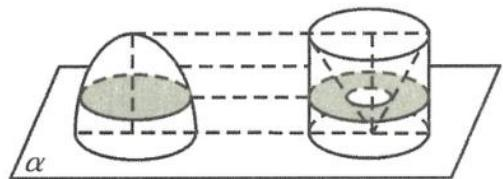

> [!faq]- 《浙大优辅《高中数学新体系 立体几何的秘密》》例题解析
>
> > [!success]- **【答案】** A
>
> > [!note]- **【分析】**
> > 本题未单列分析。
>
> > [!note]- **【解析】**
> > 解答 设命题 P: 两个几何体 A, B 的体积不相等;
> > 命题 Q: A, B 在等高处的截面面积不恒相等.
> > 所以 $\neg Q \Rightarrow \neg P$ 等价于 $P \Rightarrow Q$ . 故选 A.
> > 引申 某学习合作小组学习了祖暅原理：“幂势既同，则积不容异”。利用祖暅原理研究椭
> > 圆 $\frac{x^2}{a^2} +\frac{y^2}{b^2} = 1(a > b > 0)$ 绕 $y$ 轴旋转一周所得到的椭球体的体积.方法如下：取一个底面圆半径为 $a$ 、高为 $b$ 的圆柱，从圆柱中挖去一个以圆柱上底面为底面，下底面圆心为顶点的圆锥，把所得的几何体和半
> > 
> > 图5.1-10
> > 椭球体放在同一平面 $\alpha$ 上(图 5.1-10)，那么这两个几何体也就夹在两个平行平面之间了。现在用平行于平面的任意一个平面 $\beta$ 来截这两个几何体，则截面分别是圆面和圆环面。经研究，圆面面积和圆环面面积相等，由此得到椭球体的体积是 \_\_\_\_。
> > 解答 由题意,圆柱中挖去一个以圆柱上底面为底面,下底面圆心为顶点的圆锥,剩下的体积为
> > $$
> > \pi a ^ {2} b - \frac {1}{3} \pi a ^ {2} b = \frac {2}{3} \pi a ^ {2} b.
> > $$
> > 根据祖暅原理,半椭球体的体积为
> > $$
> > \frac {V}{2} = \frac {2}{3} \pi a ^ {2} b,
> > $$
> > 所以椭球体的体积为
> > $$
> > V = \frac {4}{3} \pi a ^ {2} b.
> > $$
