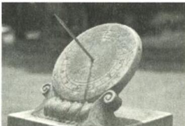
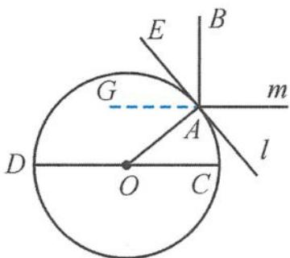
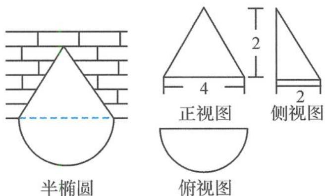

> [!faq]- 《浙大优辅《高中数学新体系 立体几何的秘密》》例题解析
>
> > [!success]- **【答案】** B
>
> > [!note]- **【分析】**
> > 本题未单列分析。
>
> > [!note]- **【解析】**
> > 
> > $$
> > 9 0 ^ {\circ}
> > $$
> > 解答 画出截面图,如图5.1-11,其中 $CD$ 是赤道所在平面的截线, $l$ 是点 $A$ 处的水平面的截线.依题意可知 $OA \perp l$ . $AB$ 是晷针所在直线, $m$ 是晷面的截线,依题意,晷面和赤道平面平行,晷针与晷面垂直.根据平面平行的性质定理可知 $m \parallel CD$ ,根据线面垂直的定义可得 $AB \perp m$ .
> > 由于 $\angle AOC = 40^{\circ}, m \parallel CD$ ，所以
> > $$
> > \angle O A G = \angle A O C = 4 0 ^ {\circ}.
> > $$
> > 由于 $\angle OAG + \angle GAE = \angle BAE + \angle GAE = 90^{\circ}$ ，所以 $\angle BAE = \angle OAG = 40^{\circ},$
> > 即晷针与点 A 处的水平面所成的角为 $\angle BAE = 40^{\circ}$ .
> > 
> > 图5.1-11
> > 故选 B.
> > 引申 元朝《洋明算法》记录了一首关于圆锥仓窖问题中近似快速计算粮堆体积的诗歌：尖堆法用三十六，倚壁须分十八停。
> > 内角聚时如九一,外角三九甚分明.
> > 每一句表达一种形式的堆积公式, 比如第二句的意思: 粮食靠墙堆积成半圆锥体, 其体积为底面半圆弧长的平方乘以高, 再除以 18. 现有一堆靠墙的半圆锥体粮堆, 其三视图如图 5.1-12 所示. 按照古诗中的算法, 其体积近似值是 $(\pi \approx 3)$ ( ). A. 2 B. 4 C. 8 D. 16
> > 
> > 半椭圆
> > 俯视图
> > 图5.1-12
> > 解答 依题意,该几何体是底面半径为2,高为2的半圆锥体,所以其底面半圆弧为
> > $$
> > l = \frac {1}{2} \times 2 \times 2 \pi = 2 \pi ,
> > $$
> > 所以
> > $$
> > V = \frac {(2 \pi) ^ {2} \times 2}{1 8} = \frac {8 \pi^ {2}}{1 8} \approx 4.
> > $$
> > 故选B.
> > 点评 这是全书唯一的一道有关三视图的题目,由于新课标把三视图的内容删去了,所以我们使用新教材的同学只作欣赏.
