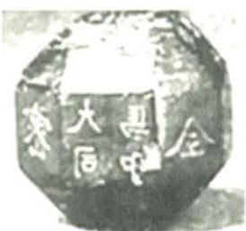
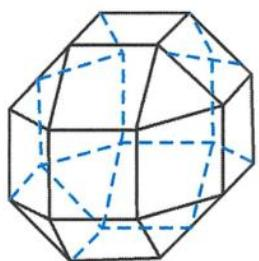
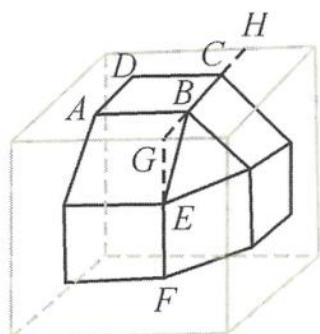

> [!faq]- 《浙大优辅《高中数学新体系 立体几何的秘密》》例题解析
>
> > [!success]- **【答案】** C
>
> > [!note]- **【分析】**
> > 本题未单列分析。
>
> > [!note]- **【解析】**
> > 解答 本题属于正四面体外接球问题,所需要材料质量即为正四面体外接球体积与正四面体体积之差. 正四面体的棱长为 a, 则正四面体的高为 $\frac{\sqrt{6}a}{3}$ , 外接球的半径为 $\frac{\sqrt{6}a}{4}$ , 内切球的半径为 $\frac{\sqrt{6}a}{12}$ . 所以 3D 打印的体积
> > $$
> > V = \frac {4}{3} \pi \left(\frac {\sqrt {6}}{4} a\right) ^ {3} - \frac {1}{3} \times \frac {1}{2} a ^ {2} \times \frac {\sqrt {3}}{2} \times \frac {\sqrt {6}}{3} a = \frac {\sqrt {6}}{8} a ^ {3} \pi - \frac {\sqrt {2}}{1 2} a ^ {3}.
> > $$
> > 因为 $a^3 = 48\sqrt{6}$ ，所以
> > $$
> > V = 3 6 \pi - 8 \sqrt {3} \approx 1 1 3. 0 4 - 1 3. 8 4 = 9 9. 2.
> > $$
> > 故选C.
> > 引申 中国有悠久的金石文化,印信是金石文化的代表之一.印信的形状多为长方体、正方体或圆柱体,但南北朝时期的官员独孤信的印信形状是“半正多面体”(图5.1-13).半正多面体是由两种或两种以上的正多边形围成的多面体.半正多面体体现了数学的对称美.图5.1-14是一个棱数为48的半正多面体,它的所有顶点都在同一个正方体的表面上,且此正方体的棱长为1.则该半正多面体共有\_\_\_\_个面,其棱长为\_\_\_\_.
> > 
> > 图5.1-13
> > 
> > 图5.1-14
> > 解答 由图5.1-14可知第一层与第三层各有9个面,计18个面,第二层共有8个面,所以该半正多面体共有 $18+8=26$ 个面.
> > 如图 5.1-15, 设该半正多面体的棱长为 $x$ , 则 $AB = BE = x$ . 延长 $BC$ , 与 $FE$ 交于点 $G$ . 延长 $BC$ , 交正方体的棱于点 $H$ . 由半正多面体的对称性可知, $\triangle BGE$ 为等腰直角三角形, 所以
> > $$
> > B G = G E = G H = \frac {\sqrt {2}}{2} x, G H = 2 \times \frac {\sqrt {2}}{2} x + x = (\sqrt {2} + 1) x = 1,
> > $$
> > 从而
> > $$
> > x = \frac {1}{\sqrt {2} + 1} = \sqrt {2} - 1.
> > $$
> > 
> > 图5.1-15
> > 该半正多面体的棱长为 $\sqrt{2}-1$ .
> > 故答案为 $26, \sqrt{2} - 1$ .
> > 点评 本题立意新颖,对于空间想象能力考查要求高,物体位置还原是关键.遇到新题别慌乱,题目其实很简单,稳中求胜是关键.
> > ## 5.1.3 与现代文化有关
