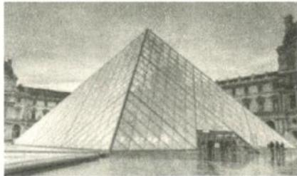
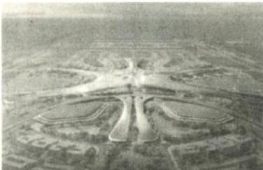
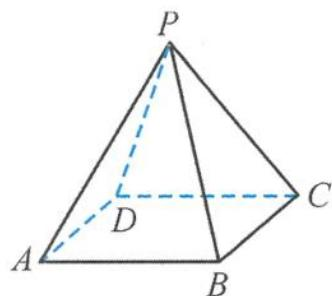

> [!faq]- 《浙大优辅《高中数学新体系 立体几何的秘密》》例题解析
>
> > [!success]- **【答案】** A
>
> > [!note]- **【分析】**
> > 本题未单列分析。
>
> > [!note]- **【解析】**
> > 
> > 解答 根据题意 $V = \frac{1}{3} \times 21 \times 34^{2} = 8092$ ，故选A.
> > 引申 1 北京大兴国际机场的显著特点之一是各种弯曲空间的运用. 刻画空间的弯曲性是几何研究的重要内容. 用曲率刻画空间弯曲性, 规定: 多面体顶点的曲率等于 $2 \pi$ 与多面体在该点的面角 (多面体的面的内角叫作多面体的面角, 角度用弧度制) 之和的差, 多面体面上非顶点的曲率均为零, 多面体的总曲率等于该多面体各顶点的曲率之和. 例如: 正四面体在每个顶点有 3 个面角, 每个面角是 $\frac{\pi}{3}$ , 所以正四面体在各顶点的曲率为 $2 \pi - 3 \times \frac{\pi}{3} = \pi$ , 故其总曲率为 $4 \pi$ .
> > 
> > (Ⅰ) 求四棱锥的总曲率.
> > (II) 若多面体满足: 顶点数 - 棱数 + 面数 = 2, 证明: 这类多面体的总曲率是常数.
> > 解答 (I) 由题可知, 四棱锥的总曲率等于四棱锥各顶点的曲率之和.
> > 可以从整个多面体的角度考虑,所有顶点相关的面角就是多面体的所有多边形表面的内角的集合.由图5.1-16可知,四棱锥共有5个顶点、5个面,其中4个为三角形、1个为四边形.
> > 所以四棱锥的表面内角和由 4 个三角形、1 个四边形组成, 则其总曲率为
> > $$
> > 2 \pi \times 5 - (4 \pi + 2 \pi) = 4 \pi .
> > $$
> > （Ⅱ）设顶点数、棱数、面数分别为 n, l, m，则
> > $$
> > n - l + m = 2.
> > $$
> > 
> > 图5.1-16
> > 设第 $i$ 个面的棱数为 $x_{i}$ ，则
> > $$
> > x _ {1} + x _ {2} + \dots + x _ {m} = 2 l,
> > $$
> > 所以总曲率为
> > $$
> > \begin{array}{r l} 2 \pi n - \pi [ (x _ {1} - 2) + (x _ {2} - 2) + \dots + (x _ {m} - 2) ] & = 2 \pi n - \pi (2 l - 2 m) \\ & = 2 \pi (n - l + m) = 4 \pi . \end{array}
> > $$
> > 所以这类多面体的总曲率是常数.
> > 点评 本题考查立体几何的新定义问题,能够正确读懂曲率的概念是解决问题的关键.
> > ## 5.2 活跃在动态空间图形中的轨迹问题综述
> > 无动态无立体几何. 立体几何的“江湖”因为有了动态而显得缤纷多彩, 由此可见动态问题在立体几何中独特的地位. 在动态空间图形中探究动点的轨迹问题, 是高中数学教学中的难点和热点, 在高考试题、各地的模拟试题中不断出现. 这类问题短小精悍, 但内容丰富多彩, 取材平淡, 朴素无华, 但回味无穷. 很多学生觉得这类问题很难, 无从下手. 很多同学想通过计算来解决, 由于运算量太大而不得不选择放弃, 也有部分学生凭数学直觉, 再借助合情推理判断出正确答案, 但真正能够深入理解此背景与本质的学生不多. 本节试图对常见的解决问题的方法进行梳理.
> > ## 5.2.1 判断动点轨迹类型的方法
> > ## (1) 截面法
> > 借助于一些几何体的模型,利用几何体的截面进行推理,往往能使问题的解决“柳暗花明”.例如圆锥曲线就可以看作圆锥被一个平面所截得到的截口曲线.
