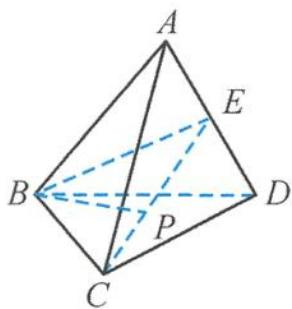
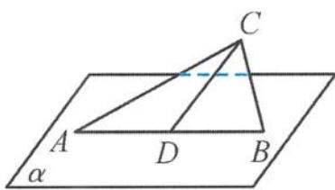

> [!faq]- 《浙大优辅《高中数学新体系 立体几何的秘密》》例题解析
>
> > [!success]- **【答案】** A
>
> > [!note]- **【分析】**
> > 分析 初看这道试题,好像无从下手.其实,由于 $\triangle ABP$ 的面积为定值,易得点 $P$ 到直线 $AB$ 的距离不变,所以点 $P$ 在以 $AB$ 为轴的圆柱体的表面上运动.因为点 $P$ 在平面 $\alpha$ 内,所以问题就转化为圆柱被不平行于轴与底面的平面所截的截面问题,用平面去截圆柱,截得的交线是椭圆(图5.2-2),因此选B.
> >
> > 点评 如果我们建立坐标系进行直接计算的话,就会陷入一种非常被动、烦琐的尴尬地步,其实对于一道选择题来说,“小题不必大做”是一个重要的原则.
> >
> > 引申 1 已知正四面体 ABCD, 空间一动点 P 满足 BP ⊥ AD, 且 △PAD 的面积为定值, 则点 P 的轨迹为( ). A. 直线 B. 圆 C. 椭圆 D. 抛物线
> >
> > 解答 如图5.2-3, 过 $BC, BP$ 作平面 $BCP$ , 交 $AD$ 于点 $E$ , 连接 $BE, CE$ . 因为正四面体 $ABCD$ , 所以 $AD \perp BC$ . 又 $BP \perp AD$ , 所以 $AD \perp$ 平面 $BCE$ , 即点 $P$ 在过点 $B$ 且垂直于 $AD$ 的平面 $BCE$ 内.
> >
> > 
> >
> > 因为 $\triangle PAD$ 的面积为定值, 可得点 P 到直线 AD 的距离为定值, 故点 P 在以 AD 为轴的圆柱面上, 故点 P 既在圆柱面上又在平面 BCE 内.
> >
> > 图5.2-3
> >
> > 由于平面 BCE 与圆柱的轴垂直, 故点 P 的轨迹为圆. 所以选 B.
> >
> > 引申 2 在四棱柱 $ABCD-A_{1}B_{1}C_{1}D_{1}$ 中, 已知侧棱 $DD_{1} \perp$ 底面 ABCD, Q 为直线 $CD_{1}$ 上的动点, P 为底面 ABCD 上的动点. 当 $\triangle D_{1}PC$ 的面积为定值 b (b > 0) 时, 点 P 在底面 ABCD 上的运动轨迹为 ( ). A. 椭圆 B. 双曲线 C. 抛物线 D. 圆
> >
> > 解答 因为点 P 到线段 $D_{1}C$ 的距离为定值, 所以点 P 的轨迹为圆柱的侧面. 又点 P 在平面 ABCD 上, 所以运动轨迹为椭圆. 故选 A.
> >
> > 
> >
> > 引申 3 如图 5.2-4, 已知平面 $ABC \perp$ 平面 $\alpha, D$ 为线段 $AB$ 的中点, $|AB| = 2\sqrt{2}, \angle CDB = 45^\circ$ , 点 $P$ 为平面 $\alpha$ 内的动点, 且点 $P$ 到直线 $CD$ 的距离为 $\sqrt{2}$ , 则 $\angle APB$ 的最大值为 \_\_\_\_.
> >
> > 图5.2-4
> >
> > 解答 由于点 P 到直线 CD 的距离为 $\sqrt{2}$ ，因此点 P 在以直线 CD 为轴、 $\sqrt{2}$ 为底面半径长的圆柱上。又点 P 是平面 $\alpha$ 内的动点，所以点 P 的轨迹是一个椭圆，其离心率 $e = \sin 45^{\circ} = \frac{\sqrt{2}}{2}$ ，短半轴 $b = \sqrt{2}$ ，故焦距 $2c = 2\sqrt{2}$ ，即 A, B 为椭圆的焦点，易求 $\angle APB$ 的最大值为 $\frac{\pi}{2}$ 。
>
> > [!note]- **【解析】**
> > 本题未单列解析。
