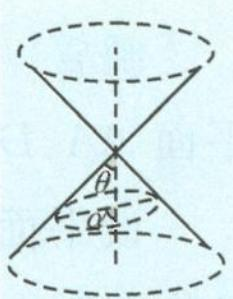

> [!faq]- 《浙大优辅《高中数学新体系 立体几何的秘密》》例题解析
>
> > [!success]- **【答案】** C
>
> > [!note]- **【分析】**
> > 本题未单列分析。
>
> > [!note]- **【解析】**
> > 解答 由题意可知, 当点 $P$ 运动时, 在空间中, 满足条件的 $AP$ 绕 $AB$ 旋转形成一个圆锥,用一个与圆锥的高成 $60^{\circ}$ 角的平面去截圆锥, 所得图形为椭圆. 故选 C.
> > 引申 1 已知圆柱的轴截面 ABCD 是边长为 2 的正方形, M 为正方形 ABCD 对角线的交点, 动点 P 在圆柱下底面内 (包括圆周). 若直线 AM 与直线 MP 所成的角为 $45^{\circ}$ , 则点 P 形成的轨迹为 ( ).
> > A. 椭圆的一部分
> > B. 抛物线的一部分
> > C. 双曲线的一部分
> > D. 圆的一部分
> > 解答 因为直线 AM 与直线 MP 所成的角为 $45^{\circ}$ ，所以直线 MP 在以直线 AM 为轴的圆锥面上，易得点 P 形成的轨迹为抛物线的一部分，故选 B.
> > 引申 2 设 m 是平面 $\alpha$ 内的一条定直线, P 是平面 $\alpha$ 外的一个定点, 动直线 n 经过点 P 且与 m 成 $30^{\circ}$ 角, 则直线 n 与平面 $\alpha$ 的交点 Q 的轨迹是 ( ).
> > A. 圆
> > B. 椭圆
> > C. 双曲线
> > D. 抛物线
> > 解答 动直线 n 的轨迹是以点 P 为顶点、平行于 m 的直线为轴的两个圆锥面，而点 Q 的轨迹就是这两个圆锥面与平面 $\alpha$ 的交线，所以点 Q 的轨迹是双曲线。故选 C.
> > 知识储备 如图 5.2-5, 设圆锥的轴截面顶角为 $2\theta$ , 圆锥的轴与截面所成的角为 $\alpha$ , 其中 $\alpha, \theta \in \left(0, \frac{\pi}{2}\right)$ .
> > 当 $\alpha > \theta$ 时，截口曲线为椭圆；
> > 当 $\alpha = \theta$ 时，截口曲线为抛物线；
> > 当 $\alpha < \theta$ 时，截口曲线为双曲线.
> > 
> > 图5.2-5
