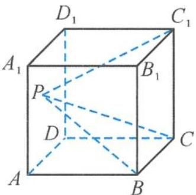
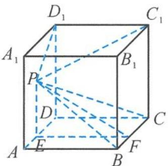
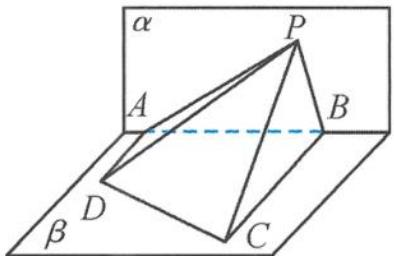

> [!faq]- 《浙大优辅《高中数学新体系 立体几何的秘密》》例题解析
>
> > [!success]- **【答案】** D
>
> > [!note]- **【分析】**
> > 本题未单列分析。
>
> > [!note]- **【解析】**
> > 
> > 图5.2-6
> > 
> > 图5.2-7
> > 解答 如图 5.2-7, 连接 $PD_{1}$ . 因为 $C_{1}D_{1} \perp$ 平面 $AA_{1}D_{1}D$ , 所以 $\angle C_{1}PD_{1}$ 为直线 $PC_{1}$ 与平面 $AA_{1}D_{1}D$ 所成的角.
> > 设平面 $PBC$ 与平面 $AA_{1}D_{1}D$ 所成二面角的棱为 $l$ , 则 $l \parallel BC$ . 过点 $P$ 作 $PE \perp AD$ , 过点 $E$ 作 $EF \parallel AB$ , 则 $AD \perp$ 平面 $PEF$ , 所以 $l \perp$ 平面 $PEF$ , 即 $\angle EPF$ 为平面 $PBC$ 与平面 $AA_{1}D_{1}D$ 所成二面角的平面角.
> > 因为直线 $PC_{1}$ 与平面 $AA_{1}D_{1}D$ 所成的角的大小等于平面 PBC 与平面 $AA_{1}D_{1}D$ 所成锐二面角的大小, 所以点 P 到点 $D_{1}$ 的距离与点 P 到直线 AD 的距离相等, 所以点 P 的轨迹为抛物线. 故选 D.
> > 引申 1 如图 5.2-8, 已知 $\triangle PAB$ 所在的平面 $\alpha$ 和四边形 $ABCD$ 所在的平面 $\beta$ 互相垂直, 且 $AD \perp \alpha, BC \perp \alpha, AD = 4, BC = 8, AB = 6$ . 若 $\tan \angle ADP + 2\tan \angle BCP = 10$ , 则点 $P$ 在平面 $\alpha$ 内的轨迹是 ( ).
> > 
> > 图5.2-8
> > $$
> > \tan \angle A D P = \frac {P A}{4}, \tan \angle B C P = \frac {P B}{8},
> > $$
> > 所以
> > $$
> > P A + P B = 4 0 > | A B | = 6.
> > $$
> > 由椭圆的定义知, 点 P 在平面 $\alpha$ 内的轨迹是椭圆的一部分. 故选 B.
> > 引申 2 已知点 P 是正四面体 A-BCD 内的动点, E 是棱 CD 的中点, 且点 P 到棱 AB 和棱 CD 的距离相等, 则点 P 的轨迹被平面 ABE 所截得的图形为( ). A. 线段 B. 椭圆的一部分 C. 双曲线的一部分 D. 抛物线的一部分
> > 解答 由条件得 $CD \perp$ 平面 $ABE$ , 所以点 $P$ 到棱 $CD$ 的距离为 $PE$ . 因此, 在平面 $ABE$ 内, 动点 $P$ 到棱 $AB$ 和到定点 $E$ 的距离相等.
> > 由抛物线的定义得,动点 P 的轨迹是抛物线.故选 D.
> > 引申 3 已知正方体 $ABCD-A_{1}B_{1}C_{1}D_{1}$ 的棱长为 a，定点 M 在棱 AB 上（不在端点 A, B 上），点 P 是平面 ABCD 内的动点，且点 P 到直线 $A_{1}D_{1}$ 的距离与点 P 到点 M 的距离的平方差为 $a^{2}$ ，则点 P 的轨迹所在的曲线为（）.
> > A. 圆
> > B. 椭圆
> > C. 双曲线
> > D. 抛物线
> > 解答 在正方体 $ABCD-A_{1}B_{1}C_{1}D_{1}$ 中, 过点 P 作 $PF \perp AD$ , 过点 F 作 $FE \perp A_{1}D_{1}$ , 垂足分别为 F, E. 连接 PF, 则
> > $$
> > P E ^ {2} = a ^ {2} + P F ^ {2}
> > $$
> > 又 $PE^2 - PM^2 = a^2$ ，所以 $PM^2 = PF^2$ ，即 $PM = PF$ .
> > 故点 P 到直线 AD 与到点 M 的距离相等(点 M 不在直线 AD 上). 由抛物线的定义知, 点 P 的轨迹是以 M 为焦点、AD 为准线的抛物线.
> >
> > 故选 **D**.
