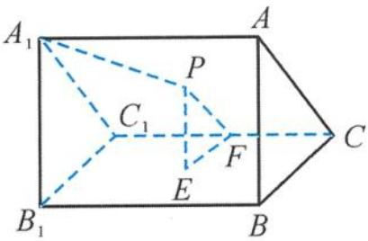

> [!faq]- 《浙大优辅《高中数学新体系 立体几何的秘密》》例题解析
>
> > [!success]- **【答案】** C
>
> > [!note]- **【分析】**
> > 本题未单列分析。
>
> > [!note]- **【解析】**
> > 解答 如图 5.2-9, 过点 P 作 $PE \perp$ 平面 $BB_{1}C_{1}C$ 于点 E, 过点 E 作 $EF \perp CC_{1}$ , 连接 PF. 由三垂线定理知 $PF \perp CC_{1}$ , 所以
> > $$
> > \angle P F E = 6 0 ^ {\circ}.
> > $$
> > 
> > 因此
> > 图5.2-9
> > $$
> > P F = \frac {P E}{\sin 6 0 ^ {\circ}} = \frac {2 d}{\sqrt {3}},
> > $$
> > 从而
> > $$
> > \frac {P A _ {1}}{P F} = \sqrt {3} > 1.
> > $$
> > 由圆锥曲线的第二定义知, 点 P 的轨迹为双曲线的一部分. 故选 C.
> > 点评 利用定义法探求空间图形中的轨迹问题,要善于把立体几何问题转化到平面上,然后借助于有关平面几何中的定义解答.
> > ## (3) 向量法
> > 对于一些几何特征不太明显的轨迹问题,往往需要借助向量进行解答.向量解题不仅让人耳目一新,而且向量的威力也让人刮目相看.
