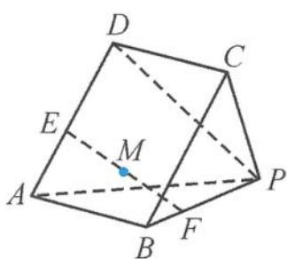
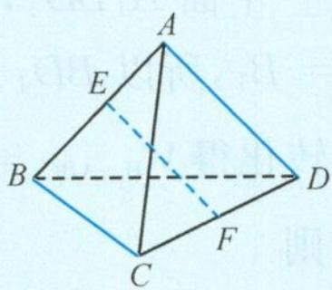

> [!faq]- 《浙大优辅《高中数学新体系 立体几何的秘密》》例题解析
>
> > [!success]- **【答案】** D
>
> > [!note]- **【分析】**
> > 本题未单列分析。
>
> > [!note]- **【解析】**
> > 解答 建立空间直角坐标系,设 $A(0,-1,0)$ , $B(0,1,0)$ , $S(0,0,\sqrt{3})$ , $M\left(0,0,\frac{\sqrt{3}}{2}\right)$ , $P(x,y,0)$ ,
> > 则
> > $$
> > \overrightarrow {A M} = (0, 1, \frac {\sqrt {3}}{2}), \overrightarrow {M P} = (x, y, - \frac {\sqrt {3}}{2}).
> > $$
> > 由于 $AM \perp MP$ ，所以 $\left(0,1,\frac{\sqrt{3}}{2}\right) \cdot \left(x,y,-\frac{\sqrt{3}}{2}\right) = 0$ ，即
> > $$
> > y = \frac {3}{4}.
> > $$
> > 此为点 P 形成的轨迹方程, 其在底面圆盘内的长度为
> > $$
> > 2 \sqrt {1 - \left(\frac {3}{4}\right) ^ {2}} = \frac {\sqrt {7}}{2}.
> > $$
> > 故选B.
> > 引申 1 如图 5.2-10, 在底面为平行四边形的四棱锥 P-ABCD 中, 已知 E, F 分别是棱 AD, BP 上的动点, 且满足 AE = 2BF, 则线段 EF 的中点 M 的轨迹是( ). A. 一条线段 B. 一段圆弧 C. 抛物线的一部分 D. 一个平行四边形
> > 
> > 图5.2-10
> > 解答 因为 AE = 2BF，设 $\left|\overrightarrow{BF}\right| = t$ ，则
> > $$
> > | \overrightarrow {A E} | = 2 t.
> > $$
> > 设线段 AB 的中点为 O，由中位向量公式得
> > $$
> > \overrightarrow {O M} = \frac {1}{2} (\overrightarrow {A E} + \overrightarrow {B F}) = \frac {1}{2} \left(2 t \frac {\overrightarrow {A E}}{| \overrightarrow {A E} |} + t \frac {\overrightarrow {B F}}{| \overrightarrow {B F} |}\right) = \frac {t}{2} \left(2 \frac {\overrightarrow {A E}}{| \overrightarrow {A E} |} + \frac {\overrightarrow {B F}}{| \overrightarrow {B F} |}\right).
> > $$
> > 即 $\overrightarrow{OM}$ 与定向量 $2\frac{\overrightarrow{AE}}{|\overrightarrow{AE}|}+\frac{\overrightarrow{BF}}{|\overrightarrow{BF}|}$ 共线,而且O为定点,所以点M的轨迹是一条线段.故选A.
> > 引申 2 在正四面体 ABCD 中, 已知 P, Q 分别是棱 AB, CD 的中点, E, F 分别是直线 AB, CD 上的动点, M 是 EF 的中点, 则能使点 M 的轨迹是圆的条件是(   ). A. $PE + QF = 2$ B. $PE \cdot QF = 2$ C. PE = 2QF D. $PE^{2} + QF^{2} = 2$
> > 解答 分别取 $BC, BD, AC, AD$ 的中点 $G, H, K, L$ . 因为 $P, Q$ 是定点, 所以 $PQ$ 的中点 $O$ 为定点. 由对称性可知, $PQ, EF$ 的中点在中截面 $GHLK$ 上运动. 因为
> > $$
> > \overrightarrow {O M} = \overrightarrow {O P} + \overrightarrow {P E} + \overrightarrow {E M} = \overrightarrow {O Q} + \overrightarrow {Q F} + \overrightarrow {F M},
> > $$
> > 所以
> > $$
> > \overrightarrow {O M} = \frac {1}{2} (\overrightarrow {P E} + \overrightarrow {Q F}).
> > $$
> > 在正四面体中,对棱垂直,所以 $PE \perp QF$ ,
> > $$
> > \mid \overrightarrow {P E} + \overrightarrow {Q F} \mid^ {2} = \mid \overrightarrow {P E} \mid^ {2} + \mid \overrightarrow {Q F} \mid^ {2},
> > $$
> > 从而
> > $$
> > 4 \mid \overrightarrow {O M} \mid^ {2} = \mid \overrightarrow {P E} + \overrightarrow {Q F} \mid^ {2} = \mid \overrightarrow {P E} \mid^ {2} + \mid \overrightarrow {Q F} \mid^ {2}.
> > $$
> > 若点 M 的轨迹是以 O 为圆心的圆, 则 $\left|\overrightarrow{PE}\right| + \left|\overrightarrow{QF}\right|^2$ 为定值, 只有选项 D 符合题意. 故选 D.
> > 知识储备 空间四边形的中位向量公式:如图 5.2-11,在空间四边形 ABCD 中,E,F 分别为 AB,CD 的中点,则
> > $$
> > \overrightarrow {E F} = \frac {1}{2} (\overrightarrow {A D} + \overrightarrow {B C}).
> > $$
> > 
> > 图5.2-11
> > ## 5.2.2 求动点轨迹的几何量(长度、周长、面积与体积等)
> > 动点轨迹问题经常涉及求动点轨迹的长度、周长、面积与体积等,对于这类问题往往是先求轨迹,再根据轨迹的特征求动点轨迹的几何量.
