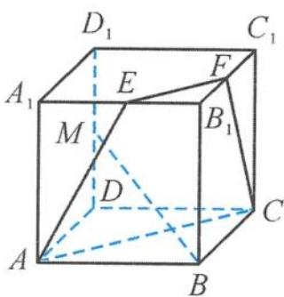
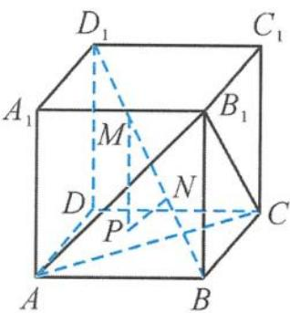
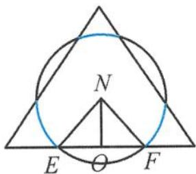
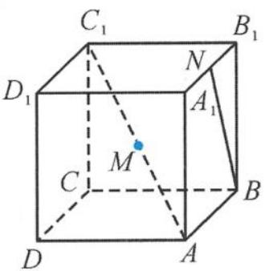
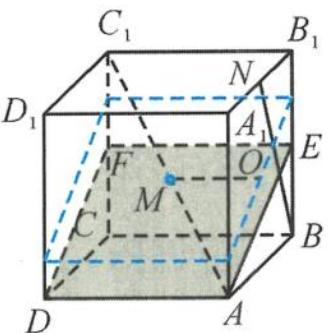

> [!faq]- 《浙大优辅《高中数学新体系 立体几何的秘密》》例题解析
>
> > [!success]- **【答案】** C
>
> > [!note]- **【分析】**
> > 本题未单列分析。
>
> > [!note]- **【解析】**
> > 解答 如图 5.2-12, 取 $A_{1}B_{1}$ 的中点 E, 易证明
> > $$
> > B M \perp A E.
> > $$
> > 取 $B_{1}C_{1}$ 的中点 $F$ , 易证明
> > $$
> > B M \perp F C.
> > $$
> > 
> > 所以 $BM \perp$ 平面 $ACFE$ , 即与 $BM$ 垂直的直线 $AP$ 都在平面 $ACFE$ 内. 又点 $P$ 在侧面 $BCC_{1}B_{1}$ 及其边界上移动, 故点 $P$ 在这两个平面的交线上, 即点 $P$ 在线段 $FC$ 上, 易求
> > 图5.2-12
> > $$
> > F C = \sqrt {5},
> > $$
> > 即动点 P 的轨迹的长度为 $\sqrt{5}$ . 故选 C.
> > 引申1 如图5.2-13, 已知正方体 $ABCD-A_{1}B_{1}C_{1}D_{1}$ 的棱长为 $2\sqrt{3}, M, N$ 为体对角线 $BD_{1}$ 的三等分点, 动点 $P$ 在 $\triangle ACB_{1}$ 内, 且 $\triangle PMN$ 的面积 $S_{\triangle PMN} = \frac{2\sqrt{6}}{3}$ , 则点 $P$ 的轨迹长度为( ). A. $\frac{2\sqrt{6}}{9}\pi$ B. $\frac{4\sqrt{6}}{9}\pi$ C. $\frac{2\sqrt{6}}{3}\pi$ D. $\frac{4\sqrt{6}}{3}\pi$
> > 
> > 图5.2-13
> > 解答 连接 $A_{1}B$ ，因为 $A_{1}D_{1}\perp$ 平面 $ABB_{1}A_{1}$ ，所以 $A_{1}D_{1}\perp AB_{1}$ .又 $AB_{1}$ $\perp A_1B,A_1D_1\cap A_1B = A_1$ ，所以 $AB_{1}\perp$ 平面 $A_{1}BD_{1},AB_{1}\perp BD_{1}$
> > 同理 $B_{1}C \perp BD_{1}$ , 且 $AB_{1} \cap B_{1}C = B_{1}$ , 所以 $BD_{1} \perp$ 平面 $AB_{1}C$ .
> > 在三棱锥 $B_{1} - ABC$ 中, 利用等体积转化得 $V_{B_{1} - ABC} = V_{B - ACB_{1}}$ . 因为棱长为 $2 \sqrt{3}$ , 所以 $AB_{1} = 2 \sqrt{6}$ . 设点 $B$ 到平面 $ACB_{1}$ 的距离为 $h$ , 则
> > $$
> > \frac {1}{3} \times \frac {1}{2} \times 2 \sqrt {3} \times 2 \sqrt {3} \times 2 \sqrt {3} = \frac {1}{3} \times \frac {1}{2} \times 2 \sqrt {6} \times 2 \sqrt {6} \times \frac {\sqrt {3}}{2} \times h,
> > $$
> > 解得 h = 2. 因为
> > $$
> > B D _ {1} = \sqrt {(2 \sqrt {3}) ^ {2} \times 3} = 6,
> > $$
> > 所以 $\frac{h}{BD_1} = \frac{1}{3}$ , 即点 $N$ 在平面 $ACB_{1}$ 内. 由条件可知 $MN \perp PN$ , 所以
> > $$
> > S _ {\triangle M N P} = \frac {1}{2} \times N P \times M N = \frac {1}{2} \times 2 \times N P = \frac {2}{3} \sqrt {6},
> > $$
> > 解得
> > $$
> > N P = \frac {2}{3} \sqrt {6},
> > $$
> > 即点 P 是以点 N 为圆心、 $\frac{2}{3}\sqrt{6}$ 为半径的圆，圆的周长为 $\frac{4}{3}\sqrt{6}\pi$ .
> > 如图 5.2-14, 点 P 的轨迹为圆在三角形内部的弧长, 点 N 到底面的距离为 $\sqrt{2}, NE = \frac{2\sqrt{6}}{3}, \cos \angle ENO = \frac{NO}{NE} = \frac{\sqrt{3}}{2}$ , 所以 $\angle ENO = 30^{\circ}, \angle ENF = 60^{\circ}.$
> > 
> > 图5.2-14
> > 由对称性可知,圆内的弧长占圆周长的 $\frac{1}{2}$ ，所以点P的轨迹周长为 $\frac{2\sqrt{6}}{3}\pi$ .
> > 故选 C.
> > 引申 2 如图 5.2-15, 在棱长为 1 的正方体 $ABCD-A_{1}B_{1}C_{1}D_{1}$ 中, 已知 $M, N$ 分别为 $AC_{1}$ , $A_{1}B_{1}$ 的中点, 点 $P$ 在正方体的表面上运动, 则总能使 $MP$ 与 $BN$ 垂直的点 $P$ 所构成的轨迹的周长为 \_\_\_\_.
> > 
> > 图5.2-15
> > 
> > 图5.2-16
> > 解答 依题意,只需过点 M 作直线 BN 的垂面即可,垂面与正方体表面的交线即为动点 P 的轨迹.
> > 分别取 $BB_{1}, CC_{1}$ 的中点 E, F, 易知 $BN \perp$ 平面 ADFE. 过点 M 及侧面 $ABB_{1}A_{1}$ 的中心 O 作平面 ADFE 的平行平面（图 5.2-16 中灰色的四边形），点 P 所构成的轨迹即为图 5.2-16 中蓝色的四边形，其周长与四边形 ADFE 的周长相等，所以点 P 所构成的轨迹的周长为 $2 + \sqrt{5}$ .
