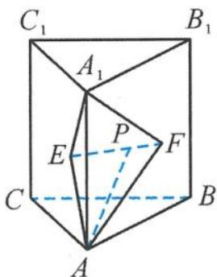
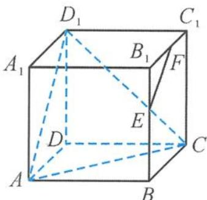

> [!faq]- 《浙大优辅《高中数学新体系 立体几何的秘密》》例题解析
>
> > [!success]- **【答案】** B
>
> > [!note]- **【分析】**
> > 本题未单列分析。
>
> > [!note]- **【解析】**
> > $$
> > A P \perp E F
> > $$
> > A. $\frac{\pi}{3}$ B. $\frac{2\pi}{3}$ C. $\frac{4\pi}{3}$ D. $\frac{8\pi}{3}$
> > 
> > 图5.2-17
> > 解答 因为二面角 $A-EF-A_{1}$ 为直二面角, 所以
> > 平面 $AEF \perp$ 平面 $A_{1}EF$ .
> > 又 $AP \perp EF$ ，故 $AP \perp$ 平面 $A_{1}EF$ ，因此
> > $$
> > A P \perp A _ {1} P.
> > $$
> > 得到点 P 的轨迹为以 $A_{1}A$ 为直径的球面在三棱柱 $ABC-A_{1}B_{1}C_{1}$ 内部的曲面.
> > 因为三棱柱 $ABC - A_{1}B_{1}C_{1}$ 为正三棱柱，所以点 $P$ 的轨迹为以 $A_{1}A$ 为直径的球面的 $\frac{1}{6}$ ，得点 $P$ 的轨迹的面积是
> > $$
> > \frac {1}{6} \times 4 \pi = \frac {2}{3} \pi .
> > $$
> > 故选 B.
> > 引申 如图 5.2-18, 在棱长为 $\sqrt{2}$ 的正方体 $ABCD-A_{1}B_{1}C_{1}D_{1}$ 中, 已知棱 $BB_{1}, B_{1}C_{1}$ 的中点分别为 $E, F$ , 点 $P$ 在平面 $BCC_{1}B_{1}$ 内, 作 $PQ \perp$ 平面 $ACD_{1}$ , 垂足为 $Q$ . 当点 $P$ 在 $\triangle EFB_{1}$ 内 (包含边界) 运动时, 点 $Q$ 的轨迹所组成的图形的面积为 \_\_\_\_.
> > 
> > 图5.2-18
> > 解答 取 $A_{1}B_{1}$ 的中点 $G$ , 连接 $B_{1}D$ , 分别交平面 $ACD_{1}$ 、平面 $EFG$ 于点 $M, N$ , 即点 $M, N$ 分别是 $\triangle ACD_{1}, \triangle EFG$ 的中心, 易得到 $B_{1}D \perp$ 平面 $ACD_{1}$ . 所以点 $Q$ 的轨迹是平面 $EFB_{1}$ 在平面 $ACD_{1}$ 上的投影.
> > 因为平面 $ACD_{1} \parallel$ 平面 EFG, 所以点 Q 的轨迹是平面 $EFB_{1}$ 在平面 $ACD_{1}$ 上的投影, 得到
> > $$
> > S _ {\triangle E F N} = \frac {\sqrt {3}}{1 2}.
> > $$
> > ## 5.2.3 求动点轨迹与最值
> > 最值问题是高中数学中非常活跃的内容,也是难点、热点问题,在空间图形中求最值问题,具有独特的几何韵味.这种题型往往需要转化,常常需要先求轨迹再求最值,
