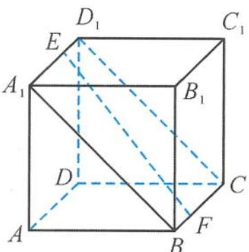

> [!faq]- 《浙大优辅《高中数学新体系 立体几何的秘密》》例题解析
>
> > [!success]- **【答案】** 详见解析
>
> > [!note]- **【分析】**
> > 本题未单列分析。
>
> > [!note]- **【解析】**
> > 解答 由于点 E 到平面 ABCD 与到平面 $BCC_{1}B_{1}$ 的距离相等, 都等于正方体的棱长, 所以
> > 
> > 图5.2-19
> > $$
> > \theta = \varphi .
> > $$
> > 因为 $A_{1}A$ 为平面ABCD的一个法向量,而EF与平面ABCD所成的角为θ,所以EF与 $A_{1}A$ 所成的角为 $\frac{\pi}{2}-\theta$ .又 $A_{1}A$ 与平面 $A_{1}BCD_{1}$ 所成的角为 $\frac{\pi}{4}$ ,由最小角定理知
> > $$
> > \frac {\pi}{2} - \theta \geqslant \frac {\pi}{4},
> > $$
> > 即 $\theta \leqslant \frac{\pi}{4}$ , 故
> > $$
> > \theta_ {\max} = \frac {\pi}{4}.
> > $$
> > 点评 化动为定, 把动直线 EF 转化到一个定平面 $A_{1}BCD_{1}$ 内, 然后转化为定直线 $A_{1}A$ 与定平面 $A_{1}BCD_{1}$ 所成角的问题.
