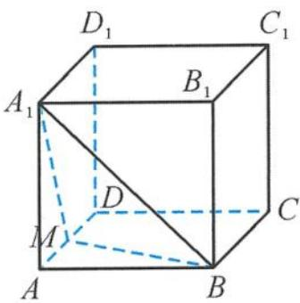
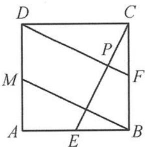

> [!faq]- 《浙大优辅《高中数学新体系 立体几何的秘密》》例题解析
>
> > [!success]- **【答案】** A
>
> > [!note]- **【分析】**
> > 本题未单列分析。
>
> > [!note]- **【解析】**
> > 
> > 解答 因为
> > 图5.2-20
> > $$
> > V _ {A _ {1} - B M P} = \frac {1}{3} \cdot 2 \cdot S _ {\triangle B M P} = \frac {2}{3},
> > $$
> > 所以 $S_{\triangle BMP} = 1$ 。设点 $P$ 到 $BM$ 的距离为 $h$ ，则
> > $$
> > S _ {\triangle B M P} = \frac {1}{2} B M \cdot h = \frac {1}{2} \sqrt {5} \cdot h = 1,
> > $$
> > 即 $h=\frac{2}{\sqrt{5}}$ . 分别取 AB, BC 的中点 E, F, 易得 $CE \perp BM$ , 则点 P 在线段 DF 上运动(图 5.2-21), 故
> > $$
> > C P _ {\mathrm{min}} = \frac {4}{\sqrt {5}} - \frac {2}{\sqrt {5}} = \frac {2}{\sqrt {5}},
> > $$
> > 从而
> > $$
> > C _ {1} P _ {\min} = \sqrt {2 ^ {2} + \left(\frac {2}{\sqrt {5}}\right) ^ {2}} = \frac {2 \sqrt {3 0}}{5}.
> > $$
> > 
> > 图5.2-21
> > 故选A.
> > 点评 这个问题虽然无法化动为定,但可以把点的动化为有规律的动,即动点的轨迹问题,再结合轨迹的特征选择求最值的方法,这也是这类题型常见的解题思路.
