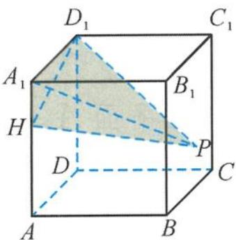
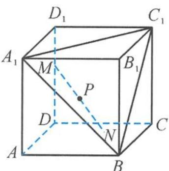
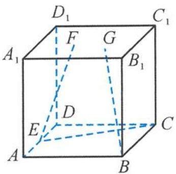
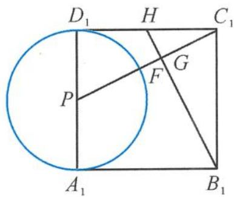
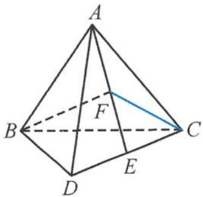
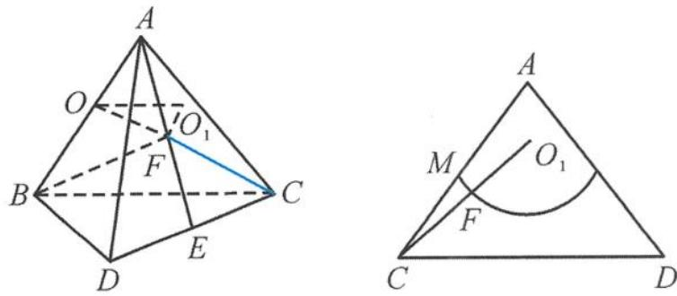

> [!faq]- 《浙大优辅《高中数学新体系 立体几何的秘密》》例题解析
>
> > [!success]- **【答案】** B
>
> > [!note]- **【分析】**
> > 本题未单列分析。
>
> > [!note]- **【解析】**
> > 
> > 图5.2-22
> > 解答 取线段 $DD_{1}$ 的三等分点 E(靠近点 $D_{1}$ ), 连接 HE, PE, 易得 $HE \perp$ 平面 $DCC_{1}D_{1}$
> > $$
> > P E = \sqrt {H P ^ {2} - H E ^ {2}} = 2 \sqrt {2},
> > $$
> > 所以点 P 在以 E 为圆心、 $2\sqrt{2}$ 为半径的圆弧上（在侧面 $DCC_{1}D_{1}$ 内）。所以点 P 到平面 $ADD_{1}A_{1}$ 距离的最大值即为 $2\sqrt{2}$ ，
> > $$
> > V = \frac {1}{3} \cdot \frac {1}{2} H A _ {1} \cdot A _ {1} D _ {1} \cdot h = \frac {1}{6} \cdot 1 \cdot 3 \cdot h \leqslant \sqrt {2}.
> > $$
> > 故选 A.
> > 引申 1 已知四棱锥 P-ABCD 的底面是边长为 2 的正方形, Q 为 BC 的中点, $PQ \perp$ 平面 ABCD, 且 PQ = 2, 动点 N 在以 D 为球心、1 为半径的球面上运动, 点 M 在平面 ABCD 内运动, 且 $PM = \sqrt{5}$ , 则 MN 长度的最小值为 ( ).
> > A. $\sqrt{5} - \frac{3}{2}$ B. $2 - \sqrt{3}$ C. $\sqrt{5} - 2$ D. $\sqrt{3} - \frac{3}{2}$
> > 解答 因为 $PM = \sqrt{5}$ , 所以点 $M$ 的轨迹是以 $Q$ 为圆心、1 为半径的半圆弧. 而点 $N$ 是在以 $D$ 为球心、1 为半径的球面上运动, 所以
> > $$
> > \mid M N \mid_ {\min} = \mid D Q \mid - 1 - 1 = \sqrt {5} - 2.
> > $$
> > 故选C.
> > 引申 2 如图 5.2-23, 已知正方体 $ABCD-A_{1}B_{1}C_{1}D_{1}$ 的棱长为 3 , 长度为 2 的线段 $MN$ 的一个端点 $M$ 在 $DD_{1}$ 上运动, 另一个端点 $N$ 在底面 $ABCD$ 内运动, 线段 $EF$ 在平面 $A_{1}C_{1}B$ 内. 求 $MN$ 的中点 $P$ 到 $EF$ 距离的最小值.
> > 
> > 解答 将求点 $P$ 到 $EF$ 距离的最小值转化为求点 $P$ 到平面 $A_{1}C_{1}B$ 的距离. 点 $P$ 在以 $D$ 为球心、1 为半径的球面上运动, 而点 $D$ 到平面 $A_{1}C_{1}B$ 的距离为 $\frac{2}{3} \times 3\sqrt{3}$ , 所以点 $P$ 到 $EF$ 距离的最小值
> > 图5.2-23
> > $$
> > d _ {\min} = \frac {2}{3} \times 3 \sqrt {3} - 1 = 2 \sqrt {3} - 1.
> > $$
> > 引申3 如图5.2-24, 已知正方体 $ABCD-A_{1}B_{1}C_{1}D_{1}$ 的棱长为 2, E 是棱 AD 的中点, 点 F, G 在平面 $A_{1}B_{1}C_{1}D_{1}$ 内. 若 $|EF|=\sqrt{5}, CE \perp BG$ , 则 $|FG|$ 的最小值为 ( ).
> > A. $\sqrt{2}-1$ B. $\frac{3\sqrt{5}}{5}-1$ C. $\frac{1}{2}$ D. $\frac{3\sqrt{5}}{5}$
> > 
> > 图5.2-24
> > 
> > 图5.2-25
> > 解答 取 $A_{1}D_{1}$ 的中点 P，连接 PF，则 $\left|PF\right|=1$ ，所以点 F 在以 P 为圆心、1 为半径的圆上运动（图 5.2-25）。取 DC 的中点 Q，连接 BQ，则 $EC \perp BQ$ 。取 $C_{1}D_{1}$ 的中点 H，连接 QH， $B_{1}H$ ，则 $EC \perp$ 平面 $BQHB_{1}$ ，即与 EC 垂直的动直线 BG 都在平面 $BQHB_{1}$ 内。
> > 因为点 $G$ 在平面 $A_{1}B_{1}C_{1}D_{1}$ 内, 所以点 $G$ 在线段 $HB_{1}$ 上. 因此问题就转化为在圆 $P$ 上找点 $F$ , 在直线 $HB_{1}$ 上找点 $G$ , 使得 $|FG|$ 最小. 易知 $PC_{1} \perp HB_{1}$ ,
> > $$
> > \mid F G \mid_ {\min} = \mid P C _ {1} \mid - \mid G C _ {1} \mid - 1 = \sqrt {5} - \frac {2}{\sqrt {5}} - 1 = \frac {3 \sqrt {5}}{5} - 1.
> > $$
> > 故选 B.
> > 引申 4 如图 5.2-26, 已知正四面体 A-BCD 的棱长为 2, E 是棱 CD 上的动点. 若 BF ⊥ AE 于点 F, 则线段 CF 的长度的最小值是 \_\_\_\_.
> > 
> > 图5.2-26
> > 
> > 图5.2-27
> > 解答 如图 5.2-27, 取 AB 的中点为 O, 因为 $BF \perp AE$ , 所以点 F 在以 O 为球心、AB 为直径的球面上.
> > 点 $F$ 在 $\triangle ACD$ 内, 由于一个平面截一个球所得的图形是一个圆面, 所以点 $F$ 的轨迹为一段圆弧. 设点 $O$ 在平面 $ACD$ 上的射影为点 $O_{1}$ , 则
> > $$
> > O O _ {1} = \frac {1}{2} \times \frac {2 \sqrt {6}}{3} = \frac {\sqrt {6}}{3},
> > $$
> > 所以
> > $$
> > O _ {1} F = \frac {\sqrt {3}}{3}.
> > $$
> > 又 $CO_{1} = \frac{\sqrt{21}}{3}$ , 故线段 $CF$ 的长度的最小值是 $\frac{\sqrt{21} - \sqrt{3}}{3}$ .
